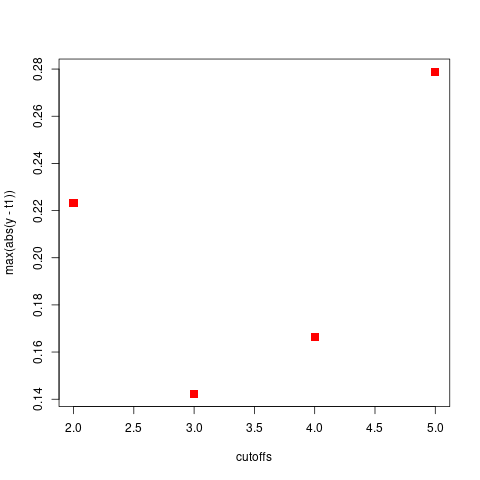

```{r, include = FALSE}
knitr::opts_chunk$set(
  collapse = TRUE,
  comment = "#>"
  )
knitr::opts_chunk$set(fig.width=6, fig.height=6, dpi=300,echo = FALSE)
knitr::opts_chunk$set(fig.pos = "H", out.extra = "")

```
A small example using the smoking  data set, containing normalized transcript measurements for 51 subjects (23 "never-smoked" and 34 "smokers")
and 22283 transcripts of lung tissue. See @Spira.et.al.2004


# load the data
```{r, echo=TRUE, eval=FALSE}
library(RFlocalfdr)
data(smoking)
?smoking 
y<-smoking$y
smoking_data<-smoking$rma
y.numeric <-ifelse((y=="never-smoked"),0,1)

```


# fit a ranger model

```{r,  echo=TRUE,  eval=FALSE}
library(ranger)
rf1 <-ranger(y=y.numeric ,x=smoking_data,importance="impurity",seed=123, num.trees = 10000,
             classification=TRUE)
t2 <-count_variables(rf1)
imp<-log(rf1$variable.importance)
#png("./supp_figures/smoking_log_importances.png")
plot(density(imp),xlab="log importances",main="")
#dev.off()

```

<!-- ```{r log_importances, echo=FALSE, fig.cap="", fig.align="center", out.width = '50%'} -->
<!-- # -->
<!--  -->

<!-- ``` -->


# Determine a cutoff to get a unimodal density.

See \@ref(fig:log_importances) for the log importances. They are clearly multimodal and we try to determine a cutoff so
that we are left with a unimodal distribution.

```{r ,echo=TRUE, eval=FALSE}
cutoffs <- c(2,3,4,5)
#png("./supp_figures/smoking_data_determine_cutoff.png")
res.con<- determine_cutoff(imp,t2,cutoff=cutoffs,plot=c(2,3,4,5))
#dev.off()

#png("./supp_figures/smoking_data_determine_cutoffs_2.png")
plot(cutoffs,res.con[,3],pch=15,col="red",cex=1.5,ylab="max(abs(y - t1))")
#dev.off()
cutoffs[which.min(res.con[,3])]

```

```{r smoking_data_determine_cutoff, echo=FALSE, fig.align="center", fig.show='hold', fig.cap="", out.width = '40%', out.height = '40%'}



```

<!-- why cant I get them side by side -->
<!-- https://stackoverflow.com/questions/25415365/insert-side-by-side-png-images-using-knitr -->


# fit RFlocalfdr

We select a cutoff of 3 and fit the RFlocalfdr model

```{r , echo=TRUE,eval=FALSE}
temp<-imp[t2 > 3]
ppp<-run.it.importances(temp,debug=0)

png("./supp_figures/smoking_significant_genes.png")
aa<-significant.genes(ppp,temp,cutoff=0.05,do.plot=1)
dev.off()

length(aa$probabilities) # 17

```
The option **do.plot=1** returns a plot containing the

- histogram of the importances in magenta
- fdr in black                     -- axis scale on right
- alpha value for significance --   axis scale on right


The option **do.plot=2** returns the same plot with the addition of 

- fitted curve using estimates_C_0.95 in red
- 0.95 quantile of the fitted distribution, also in red
- cutoff for significant genes (in orange)
- abline(v = object$C_0.95, lwd = 2, col = "blue")   what are these
- abline(v = object$cc, lwd = 2, col = "purple")

```{r smoking_significant_genes, echo=FALSE, fig.cap="", fig.align="center", out.width = '50%'}


```
