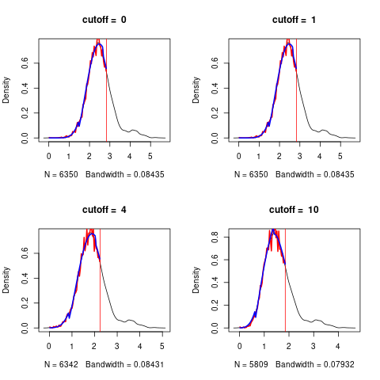

```{r setup, include=FALSE}
knitr::opts_chunk$set(fig.width=6, fig.height=6, dpi=300,echo = FALSE)
knitr::opts_chunk$set(fig.pos = "H", out.extra = "")

```

# The data

We simulate a small data set with a covariance structure to explore the actions of **RFlocalfdr**.
This package implements an empirical Bayes method of determining a significance level for the Random Forest 
MDI (Mean Decrease in Impurity) variable importance measure. 
See @dunneThresholdingGiniVariable2022 for details

We 

- simulate the data set
- fit a Random Forest model
- use RFlocalfdr to estimate the significant variables
-  estimate the significant variables using

   - Boruta (@Kursa.and.Rudnicki.2010)
   - Recursive Fearure Elimination
   - AIR (@Nembrini.et.al.2018)
   - PIMP (@Altmann.et.al.2010) 

as comparators.


## setup
We plot a small data set of $300\times  508$ to explore the data generation method.
This dataset consist of _bands_, with _blocks_ of $\{1, 2, 4, 8, 16, 32, 64\}$ of
identical variables (see figure \@ref(fig:simulation2). The variables are $\in \{0,1,2\}$, a common encoding for
genomic data where the numbers represent the number of copies of the minor allele. Only band 1 is used to calculate the
$y$ vector and $y$ is 1 if any of $X[, c(1, 2, 4, 8, 16, 32, 64)]$ is non-zero, so $y$ is unbalanced, containing more
1's than 0's. 


```{r eval=FALSE,echo=TRUE}
library(ranger)
library(RFlocalfdr)
library(caret)
library(pROC)

```
```{r ,  eval=FALSE,echo=FALSE}
packageDescription("RFlocalfdr")$GithubSHA1
#source("/home/dun280/Dropbox/R_libraries/RF_localfdr/RFlocalfdr/R/my.pimp.s")

```
```{r eval=FALSE,echo=TRUE}
set.seed(13)
num_samples <- 300
num_bands <- 4
band_rank <- 6
num_vars <- num_bands * (2 ** (band_rank+1) -1)
print(num_vars)

X <- matrix(NA, num_samples , num_vars)
set.seed(123)

temp<-matrix(0,508,3)
var_index <- 1
for(band in 1:num_bands) {
     for (rank in 0:band_rank) {
         for (i in 1:2**rank) {
           temp[var_index,]<-c(band , rank, var_index)
             var_index <- var_index +1 
         }
     }
}

#png("./supp_figures/small_simulated_data_set.png")
plot(temp[,1],ylim=c(0,10),type="p") 
lines(temp[,2],type="b",col="red")
legend(0,10,c("band","rank"),pch=1,col=c(1,2))
#dev.off()
abline(v=c( 1,  2 , 4 , 8 ,16 ,32, 64 ))

table(temp[temp[,1]==1,2])
## # 0  1  2  3  4  5  6 
## # 1  2  4  8 16 32 64 

```
```{r simulation2, echo=FALSE, fig.cap="A small simulated data set. Each band contains blocks of size {1, 2, 4, 8, 16, 32, 64}, and each block consists of correlated (identical variables).", fig.align="center", out.width = '50%'}
knitr::include_graphics("./supp_figures/small_simulated_data_set.png")

```

## data
We now generate the daa for the simulation. 
We have 50 bands and 300 observations so $X$ is $300 \times 6350$ with 127 non-null variables.  We fit a
standard RF to this dataset and record the resulting MDI importance score.

```{r eval=FALSE,echo=TRUE}
set.seed(13)
num_samples <- 300
num_bands <- 50
band_rank <- 6
num_vars <- num_bands * (2 ** (band_rank+1) -1)
print(num_vars)

X <- matrix(NA, num_samples , num_vars)
set.seed(123)
  
var_index <- 1
for(band in 1:num_bands) {
    for (rank in 0:band_rank) {
#        cat("rank=",rank,"\n")
        var <- sample(0:2, num_samples, replace=TRUE)
        for (i in 1:2**rank) {
            X[,var_index] <- var
            var_index <- var_index +1 
        }
#        print(X[1:2,1:140])
#        system("sleep 3")
    }
}

y <- as.numeric(X[,1] > 1 |  X[,2] > 1  |  X[,4] > 1 |  X[,8] > 1 |  X[,16] > 1 |
                X[,32] > 1 | X[,64] > 1 )

```

# Random forest
```{r eval=FALSE,echo=TRUE}
data <- cbind(y,X)
colnames(data) <- c("y",make.names(1:num_vars))
rfModel <- ranger(data=data,dependent.variable.name="y", importance="impurity",
             classification=TRUE,  mtry=100,num.trees = 10000, replace=TRUE, seed  = 17 )
imp <-log(ranger::importance(rfModel))
t2 <-count_variables(rfModel)
plot(density(imp))

roccurve <- roc(c(rep(1,127),rep(0,6350-127)),imp)
plot(roccurve)
auc(roccurve) # 0.9912

```


## Determine cutoff
```{r eval=FALSE,echo=TRUE}
cutoffs <- c(0,1,4,10)
#png("./supp_figures/simulated_data_determine_cutoff.png")
res.con<- determine_cutoff(imp,t2,cutoff=cutoffs,plot=c(0,1,4,10))
#dev.off()

``` 
We plot the kernel density estimate of the histogram of the data $y$, and the skew normal fit, $t_1$, using the data up to the
quantile $Q$, shown in red.

```{r , echo=FALSE, fig.cap="For this data set, the selected cutoff value is 0.", fig.align="center", out.width = '50%'}

```
```{r eval=FALSE,echo=TRUE}
plot(cutoffs,res.con[,3])
cutoffs[which.min(res.con[,3])]

```
by plotting $\max(|y - t_1|)$ versus the cutoff values, we determine the appropriate cutoff. In this case it is 
just $t2>0$


## Rflocalfdr
```{r eval=FALSE,echo=TRUE}
temp<-imp[t2 > 0]

qq <- plotQ(temp,debug.flag = 1)
ppp<-run.it.importances(qq,temp,debug=0)
aa<-significant.genes(ppp,temp,cutoff=0.05,do.plot=2)
length(aa$probabilities) # 95

tt1 <-as.numeric(gsub("X([0-9]*)","\\1",names(aa$probabilities)))
tt2 <- table(ifelse((tt1 < 127),1,2))
# 1  2 
# 59 36 
# The false discovery rate is 0.3789474
tt2[2]/(tt2[1]+tt2[2])
#59 36   36/(36+59) = 0.3789474

predicted_values<-rep(0, 6350);predicted_values[tt1]<-1
conf_matrix<-table(predicted_values,c(rep(1,127),rep(0,6350-127)))
conf_matrix
sensitivity(conf_matrix) #0.994215 TP/(TP+FN)
specificity(conf_matrix) #0.4645669 TN/(FP+TN)

roccurve <- roc(c(rep(1,127),rep(0,6350-127)),predicted_values)
plot(roccurve)
auc(roccurve) #0.7294

accuracy<-(conf_matrix[1,1]+conf_matrix[2,2])/(sum(conf_matrix))
accuracy # 0.983622

```
The FDR is 0.379. We can also calculate the sensitivity, sensitivity and accruacy.


In  order to make the comparisons with other methods, the following packages amy need to be installed.

```{r eval=FALSE,echo=TRUE}
install.packages("Boruta")
install.packages("locfdr")
install.packages("vita") 
install.packages("locfdr")
devtools::install_github("silkeszy/Pomona")

```

```{r eval=FALSE,echo=FALSE}
if (!require("BiocManager", quietly = TRUE))
    install.packages("BiocManager")
BiocManager::install("twilight")

```

# Boruta

We try the Boruta algorithm (@Kursa.and.Rudnicki.2010).

```{r eval=FALSE,echo=TRUE}
library(Boruta)
set.seed(120)  
boruta1 <- Boruta(X,as.factor(y),  num.threads = 7,getImp=getImpRfGini)
print(boruta1)
#Boruta performed 99 iterations in 19.54727 secs.
#4 attributes confirmed important: X4859, X58, X6132, X7;
# 6346 attributes confirmed unimportant: X1, X10, X100, X1000, X1001 and 6341 more;
plotImpHistory(boruta1)
aa <- which(boruta1$finalDecision=="Confirmed") 
bb <- which(boruta1$finalDecision=="Tentative") 
predicted_values <-rep(0,6350);predicted_values[c(aa,bb)]<-1
conf_matrix<-table(predicted_values,c(rep(1,127),rep(0,6350-127)))
conf_matrix

sensitivity(conf_matrix) #0.9996786 TP/(TP+FN)
specificity(conf_matrix) #0.01574803 TN/(FP+TN)

roccurve <- roc(c(rep(1,127),rep(0,6350-127)),predicted_values)
plot(roccurve)
auc(roccurve) #0.5077

accuracy<-(conf_matrix[1,1]+conf_matrix[2,2])/(sum(conf_matrix))
accuracy #0.98

```
```{verbatim, eval=FALSE,echo=TRUE}
  D  !D
+ TP FP
- FN TN
```

- Sensitivity=[TP/(TP+FN)]×100
- Specificity=[TN/(FP+TN)]×100
- Positive predictive value(PPV)= [TP/(TP+FP)]×100
- Negative predictive value(NPV)=[TN/(FN+TN)]×100.

# Recursive Feature Elimination
This is provided by the package Pomona (@Pomona.2022)
```{r eval=FALSE,echo=TRUE}
library(Pomona)
colnames(X) <- make.names(1:dim(X)[2])
set.seed(111)
res <- var.sel.rfe(X, y, prop.rm = 0.2,  recalculate = TRUE, tol = 10, 
    ntree = 500, mtry.prop = 0.2, nodesize.prop = 0.1, no.threads = 7, 
    method = "ranger", type = "classification", importance = "impurity", 
    case.weights = NULL) 
 res$var
#[1] "X1"    "X106"  "X11"   "X12"   "X127"  "X13"   "X15"   "X16"   "X2"   
#[10] "X23"   "X24"   "X3"    "X4"    "X44"   "X46"   "X4885" "X5"    "X54"  
#[19] "X5474" "X6"    "X7"    "X72"   "X9"    "X91"  
tt <-as.numeric(gsub("X([0-9]*)","\\1", res$var))
table(ifelse((tt < 127),1,2))
# 1  2 
#21  3 0.0833

res<-c(1,106, 11, 12, 127, 13, 15, 16,  2, 23, 24,  3,  4, 44, 46,  4885,  5, 54, 5474,  6,  7, 72,  9, 91)
predicted_values <-rep(0,6350);predicted_values[c(res)]<-1
conf_matrix<-table(predicted_values,c(rep(1,127),rep(0,6350-127)))
conf_matrix
sensitivity(conf_matrix) # 0.9996786 TP/(TP+FN)
specificity(conf_matrix) #0 0.1732283 TN/(FP+TN)
roccurve <- roc(c(rep(1,127),rep(0,6350-127)),predicted_values)
plot(roccurve)
auc(roccurve) #0.5865
accuracy<-(conf_matrix[1,1]+conf_matrix[2,2])/(sum(conf_matrix))
accuracy #  0.9831496

```

# AIR

See @Nembrini.et.al.2018. AIR is provided in the package _ranger_, using the option _impurity_corrected_.
```{r eval=FALSE,echo=TRUE}
rfModel2 <- ranger(data=data,dependent.variable.name="y", importance="impurity_corrected",
       classification=TRUE,  mtry=100,num.trees = 10000, replace=TRUE, seed  = 17 )
ww<- importance_pvalues( rfModel2, method = "janitza")

p <- ww[,"pvalue"]
cc <- which(p< 0.05)  
predicted_values <-rep(0,6350);predicted_values[cc]<-1
conf_matrix<-table(predicted_values,c(rep(1,127),rep(0,6350-127)))
conf_matrix
#predicted_values    0    1
#               0 5950    0
#               1  273  127
#FDR is 273/(127+273) = 0.6825

sensitivity(conf_matrix) #0.9561305 TP/(TP+FN)
specificity(conf_matrix) #1          TN/(FP+TN)
roccurve <- roc(c(rep(1,127),rep(0,6350-127)),predicted_values)
plot(roccurve)
auc(roccurve) # 0.9781
accuracy<-(conf_matrix[1,1]+conf_matrix[2,2])/(sum(conf_matrix))
accuracy #  0.9570079

```
As the null values, as modelled bt the AIR procedure, are symmetric around 0, the
question arises as to whether we can apply the locfdr (@locfdr.2015) procedure.
In this case, it reduces the FDR from 0.682 to 0.601.


```{r eval=FALSE,echo=TRUE}
plot(density(ww[,"importance"]))
imp <- ww[,"importance"]
#imp <-imp/sqrt(var(imp))
#plot(density(imp))
library(locfdr)

aa<-locfdr(imp,df=13)
which( (aa$fdr< 0.05) & (imp>0))
cc2 <-  which( (aa$fdr< 0.05) & (imp>0))
length(cc2) # [1] 309
length(intersect(cc,cc2)) #[1] 309

(length(cc2)  - length(which(cc2 <= 127)))/length(cc2) #[1] 0.6019417  fdr
predicted_values <-rep(0,6350);predicted_values[cc2]<-1
conf_matrix<-table(predicted_values,c(rep(1,127),rep(0,6350-127)))
conf_matrix
sensitivity(conf_matrix) # 0.9701109 TP/(TP+FN)
specificity(conf_matrix) #0.9685039         TN/(FP+TN)
roccurve <- roc(c(rep(1,127),rep(0,6350-127)),predicted_values)
plot(roccurve)
auc(roccurve) # 0.9693
accuracy<-(conf_matrix[1,1]+conf_matrix[2,2])/(sum(conf_matrix))
accuracy #   0.9700787

```

# PIMP


note that PIMP

- permutes the response vector $y$ $S$ times to give $y^{*s}$
- For each permutation, a new RF is grown and the permutation
  variable importance measure (VarImp$^{*s}$) for all predictor variables X is computed. 
- The vector ‘perVarImp’ of $S$ VarImp measures for every predictor variable is  used to approximate the null importance distributions
   for each variable  (see **PimpTest**)
- we are doing $p$ tests, hence a multiple testing correction is in order
- we base our work on the  PIMP implementation provided by  @vita.2015 _Variable Importance Testing Approaches_ 
- pump as described by Altman is only applicable to permutation importance.
- however we see no impediment in extending the method to Gini importance
- we have done that in our code and also 

    - fixed a small error
	- extended the code to use **ranger** as well as **randomForest** implementations of RF 


```{r eval=FALSE,echo=TRUE}
library(vita) #vita: Variable Importance Testing Approaches
y<-factor(y)
X<-data.frame(X)
set.seed(117)
cl.ranger <- ranger(y~. , X,mtry = 3,num.trees = 1000, importance = 'impurity')
system.time(pimp.varImp.cl<-my_ranger_PIMP(X,y,cl.ranger,S=10, parallel=TRUE, ncores=3)) 
pimp.t.cl <- vita::PimpTest(pimp.varImp.cl,para = FALSE)
aa <- summary(pimp.t.cl,pless = 0.1)

tt<-as.numeric(gsub("X([0-9]*)","\\1",  names(which(aa$cmat2[,"p-value"]< 0.05))))
table(ifelse((tt < 127),1,2))
# 1  2 
# 38 527      527 /(527+38) = 00.9327434

predicted_values <-rep(0,6350);predicted_values[which(aa$cmat2[,"p-value"]< 0.05)]<-1
conf_matrix<-table(predicted_values,c(rep(1,127),rep(0,6350-127)))
conf_matrix
sensitivity(conf_matrix) #0.9154749 TP/(TP+FN)
specificity(conf_matrix) #0.3070866          TN/(FP+TN)
roccurve <- roc(c(rep(1,127),rep(0,6350-127)),predicted_values)
plot(roccurve)
auc(roccurve) #  0.6113
accuracy<-(conf_matrix[1,1]+conf_matrix[2,2])/(sum(conf_matrix))
accuracy # 0.9033071
```

```{r eval=FALSE,echo=FALSE}
# twilight uses a stochastic downhill search algorithm for estimating the local false discovery rate
library(twilight)
p.values <- aa$cmat2[,"p-value"]
ans <- twilight(p.values)
fdr <- ans$result$fdr
sum(fdr < 0.05) #[1] 0

```

```{r eval=FALSE,echo=FALSE}
#how to make a neat html table in Rmarkdown
library(tables)
X <- rnorm(125, sd=100)
Group <- factor(sample(letters[1:5], 125, rep=TRUE))
tab <- tabular( Group ~ (N=1)+Format(digits=2)*X*((Mean=mean) + Heading("Std Dev")*sd) )
table_options(knit_print = FALSE)
tab        # This chunk uses the default results = 'markup'

toHTML(tab)  # This chunk uses results = 'asis'
table_options(CSS =
"<style>
#ID .center { 
  text-align:center;
  background-color: aliceblue;
} 
</style>", doCSS = TRUE)
tab
table_options(doCSS = FALSE)
```


# Conclusion

```{r table3, echo=FALSE, message=FALSE, warnings=FALSE, results='asis'}
tabl <- "
    Method     | true positives | false positives | Sensitivity        | AUC            |
    RFlocalfdr | 59             | 36              | 0.99               | 0.73           |
    Boruta     | 2              | 2               | 0.99               | 0.50           |
    RFE        | 22             | 2               | 0.99               | 0.58           |
    AIR        | 176            | 273             | 0.96               | 0.98           |
    PIMP       | 39             | 556             | 0.91               | 0.61           |
--------------------------------------------------------------------------- 
"
cat(tabl) # output the table in a format good for HTML/PDF/docx conversion

```


Performance of variable selection for the simulated example by several methods. The best outcomes for each category are in bold face.
RFE has performed better than Boruta but apart from that, ordering the methods wi  ll depend on the cost of false positives versus the cost of false negatives.


<!-- How do I get boldface in a table? neither  **0.99**  or  $\textbf{0.99}$ work -->


# References

<!-- tabular( -->
<!-- \begin{table}[tbhp] -->
<!--   \centering -->
<!--   \begin{tabular}{||p{2cm}|l|l|l|l|l|l|l||} -->
<!--     \hline -->
<!--     Method     & true positives & false positives & Sensitivity & AUC  \\ -->
<!--     \hline -->
<!--     RFlocalfdr & 59             & 36              & \textbf{0.99}       & 0.73 \\ -->
<!--     Boruta     & 2              & 2               & \textbf{0.99}        & 0.50 \\ -->
<!--     RFE        & 22             & 2               & \textbf{0.99}        & 0.58 \\ -->
<!--     AIR        & 176            & 273             & 0.96        & \textbf{0.98} \\ -->
<!--     PIMP       & 39             & 556             & 0.91        & 0.61 \\ -->
<!--     \hline -->
<!--   \end{tabular} -->
<!--   \caption{Performance of variable selection for the simulated example by several methods. The best outcomes for each -->
<!--     category are in bold face. -->
<!--   %RFE has performed better than Boruta but apart from that, ordering the methods will depend on the cost of false positives versus the cost of false negatives. -->
<!--   } -->
<!--   \label{table:simulation_results} -->
<!-- \end{table} -->
<!-- ) -->


```{r table4, echo=FALSE, message=FALSE, warnings=FALSE, results='asis'}
tabl <- "
    Method     | true positives | false positives | FDR  | Sensitivity|specificity | AUC   |
    RFlocalfdr | 59             | 36              | 0.38  | 0.99       |  *         | 0.73  |
    Boruta     | 2              | 2               | *    | 0.99       |  *         | 0.50  |
    RFE        | 22             | 2               | 0.08  | 0.99       |  *         | 0.58  |
    AIR        | 176            | 273             | 0.68  | 0.96       |  *         | 0.98  |
    AIR+locfdr | 123             | 186             | 0.61  | 0.97       | 0.97        | 0.97  |
    PIMP       | 39             | 556             | 0.93  | 0.91       |  *         | 0.61  |
--------------------------------------------------------------------------- 
"
cat(tabl) # output the table in a format good for HTML/PDF/docx conversion

```
