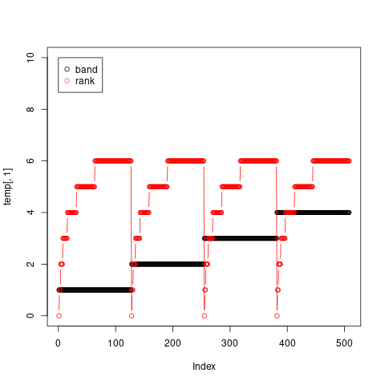
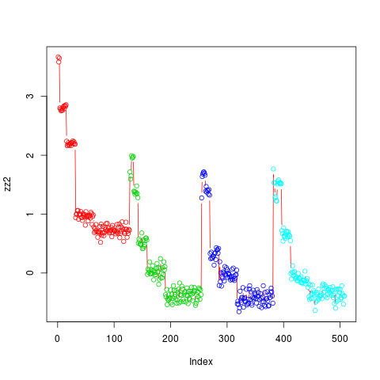

```{r setup, include=FALSE}
knitr::opts_chunk$set(fig.width=6, fig.height=6, dpi=300,echo = FALSE)
knitr::opts_chunk$set(fig.pos = "H", out.extra = "")

```
\clearpage

# Introduction


Variable importance measures are often used to perform variable selection. It is possible to identify two final aims (@genuerVariableSelectionUsing2010):

1. find a small number of variables with a maximized accuracy, or 
2. detect and rank all influential variables to focus on for interpretation and further exploration with domain experts. 

It is the second objective that is more often our aim in biomolecular work. After the important variables are selected, they
can be joined with other data from the literature or databases such as gene annotations. They can also inform further rounds of experiments.
In additions, the reduced data set can be used in other analysis methods such as extraction of structural causal models. 

The problem is characterized by:

1. a relatively small $n$ and a $p$ that is typically two to three orders of magnitude larger than $n$;
2. a lot of correlation between the variables;


# Discussion and Conclusion

We simulate a classification problem with 6350 variables of which 127 are related to the classification and a strong correlation structure. 
We consider a number of variable ranking and selection methods. We give the results for variable selection, not for the performance of the classifier.

We consider two problems:

- ranking the variables by variable importance. We have taken the point on the ROC curve that
gives the minimum cost (with equal cost for positives and negatives). So these are the best results that could be
obtained for these methods. 
- where there is a method of thresholding the importances to do variable selection, we have used it.
- where there is a method of threshold the variable importance to do variable selection, we consider the accuracy of the selected set of variables.

The results are given in the table below.
Considering the second part of the table where we select variables based on a RF impurity measure.
RFlocalfdr has done reasonably well on the FDR. Recursive Feature
Elimination has performed better but only selected a small number of
variables.


I could not get many of the SHAP implementations to converge in a 2 1/2 hour run time
limit. Shaff converged and returned one variable.
This is not surprising. The Shapley values are an "all subsets" calculation and this is NP hard. All of the methods 
available use some heuristic to get around the hardness of the problem.

As this is quite interesting, I tried a number of SHAP implementations on the smaller that set that we used for visualizing the problem.
This goes beyond the original intent of a vignette for the **RFlocalfdr** package but seems interesting to pursue.


\marginpar{ select variables based on a RF impurity measure}

```{r table3, echo=FALSE, message=FALSE, warnings=FALSE, eval=FALSE}
tabl <- "
Method       |  true positives | false positives | Sensitivity | Specificity | FDR | AUC  |
                 rank variables
RF impurity  | 55             | 6               | 0.99         | 0.43       | 0.1  | 0.99 |
RF perm.     | 61             | 3               | 0.99         | 0.48       | 0.05 | 0.74 |
RF corrected | 87             | 37              | 0.99         | 0.68       | 0.3  | 0.99 | 
cforest      | 61             | 3               | 0.99         | 0.84       | 0.12 | 0.99 |
SobolMDA     | 61             | 3               | 0.99         | 0.48       | 0.05 | 0.99 |
Shaff        | 1              | 0               |              |            |      |      |
iml Shapley  |  -             |   -             | -            |  -         | -    |  -   |
fastshap     |  -             |   -             | -            |  -         | -    |  -   |

                    select variables based on a RF impurity measure
RFlocalfdr   | 59             | 36              | 0.99         | 0.46       | 0.34 | 0.73 |
Boruta       | 2              | 2               | 0.99         | 0.016      | 0.5  | 0.51 |
AIR          | 127            | 273             | 0.96         | 1          | 0.68 | 0.98 |
AIR+locfdr   | 123            | 186             | 0.97         | 0.97       | 0.61 | 0.97 |
PIMP         | 39             | 556             | 0.91         | 0.31       | 0.58 | 0.98 |
RFE          | 22             | 2               | 0.99         | 0.17       | 0.08 | 0.58 |
"

kable(tabl, format = "markdown") #disasterous

```

\clearpage
```{R , echo=FALSE, eval=FALSE, result='asis',fig.cap='...'}

cat(tabl) # output the table in a format good for HTML/PDF/docx conversion

```


\clearpage
\begin{verbatim}
    Method     | true positives | false positives | Sensitivity | Specificity | FDR     | AUC   |
                  rank variables
    RF impurity| 55             | 6               | 0.99         | 0.43       | 0.1     | 0.99  |
    RF perm.   | 61             | 3               | 0.99         | 0.48       | 0.045   | 0.74  |
  RF corrected | 87             | 37              | 0.99         | 0.68       | 0.3     | 0.99  | 
    cforest    | 61             | 3               | 0.99         | 0.84       | 0.12    | 0.99  |
    SobolMDA   | 61             | 3               | 0.99         | 0.48       | 0.05    | 0.99  |
    Shaff      | 1              | 0               |              |            |         |       |
   fastshap    |  -             |   -             | -            |  -         | -       |  -    |
   iml Shapley |  -             |   -             | -            |  -         | -       |  -    |

    select variables based on RF
   RFlocalfdr  | 59             | 36              | 0.99         | 0.46       | 0.34    | 0.73  |
     Boruta    | 2              | 2               | 0.99         | 0.016      | 0.5     | 0.51  |
    AIR        | 127            | 273             | 0.96         | 1          | 0.68    | 0.98  |
    AIR+locfdr | 123            | 186             | 0.97         | 0.97       | 0.61    | 0.97  |
    PIMP       | 39             | 556             | 0.91         | 0.31       | 0.58    | 0.98  |
    RFE        | 22             | 2               | 0.99         | 0.17       | 0.08    | 0.58  |


    The small data set (508 variables)	
   fastshap    |  109           |   18            | 0.97         |   0.858    | 0.1     |  -    |
   iml Shapley |  -             |  -              | -            |  -         | -       |  -    |


\end{verbatim}


\clearpage


# The Simulation 

We simulate a small data set with a covariance structure to explore the actions of **RFlocalfdr**.
This package implements an empirical Bayes method of determining a significance level for the Random Forest 
MDI (Mean Decrease in Impurity) variable importance measure. 
See @dunneThresholdingGiniVariable2022 for details.

We 

- simulate the data set
- fit a Random Forest model
- use RFlocalfdr to estimate the significant variables
- for comparison, we also estimate the significant variables using

   - Boruta (@Kursa.and.Rudnicki.2010)
   - Recursive Fearure Elimination
   - AIR (@Nembrini.et.al.2018)
   - PIMP (@Altmann.et.al.2010).


## data setup


This dataset consist of _bands_, with _blocks_ of $\{1, 2, 4, 8, 16, 32, 64\}$ of
identical variables. The variables are $\in \{0,1,2\}$, a common encoding for
genomic data where the numbers represent the number of copies of the minor allele. Only band 1 is used to calculate the
$y$ vector and $y$ is 1 if any of $X[, c(1, 2, 4, 8, 16, 32, 64)]$ is non-zero, so $y$ is unbalanced, containing more
1's than 0's. 
We plot a small data set of $300\times  508$ to explore the data generation method, see figure \@ref(fig:simulation2).

For the problem we generate a data set with 50 bands and 300 observations so $X$ is $300 \times 6350$ with 127 non-null variables.  We fit a
standard RF to this dataset and record the resulting MDI importance score.

```{r eval=FALSE,echo=TRUE}
library(ranger)
library(RFlocalfdr)
library(caret)
library(pROC)

```
```{r ,  eval=FALSE,echo=FALSE}
packageDescription("RFlocalfdr")$GithubSHA1
#source("/home/dun280/Dropbox/R_libraries/RF_localfdr/RFlocalfdr/R/my.pimp.s")

```
```{r eval=FALSE,echo=FALSE}
#just plot a small data set to show the structure
set.seed(13)
num_samples <- 300
num_bands <- 4
band_rank <- 6
num_vars <- num_bands * (2 ** (band_rank+1) -1)
print(num_vars)

X <- matrix(NA, num_samples , num_vars)
set.seed(123)

temp<-matrix(0,508,3)
var_index <- 1
for(band in 1:num_bands) {
     for (rank in 0:band_rank) {
         for (i in 1:2**rank) {
           temp[var_index,]<-c(band , rank, var_index)
             var_index <- var_index +1 
         }
     }
}

#png("./supp_figures/small_simulated_data_set.png")
plot(temp[,1],ylim=c(0,10),type="p") 
lines(temp[,2],type="b",col="red")
legend(0,10,c("band","rank"),pch=1,col=c(1,2))
#dev.off()
abline(v=c( 1,  2 , 4 , 8 ,16 ,32, 64 ))

table(temp[temp[,1]==1,2])
## # 0  1  2  3  4  5  6 
## # 1  2  4  8 16 32 64


X <- matrix(NA, num_samples , num_vars)
set.seed(123)
  
var_index <- 1
for(band in 1:num_bands) {
    for (rank in 0:band_rank) {
#        cat("rank=",rank,"\n")
        var <- sample(0:2, num_samples, replace=TRUE)
        for (i in 1:2**rank) {
            X[,var_index] <- var
            var_index <- var_index +1 
        }
#        print(X[1:2,1:140])
#        system("sleep 3")
    }
}

y <- as.numeric(X[,1] > 1 |  X[,2] > 1  |  X[,4] > 1 |  X[,8] > 1 |  X[,16] > 1 |
                X[,32] > 1 | X[,64] > 1 )


data <- cbind(y,X)
colnames(data) <- c("y",make.names(1:num_vars))
    rfModel <- ranger(data=data,dependent.variable.name="y", importance="impurity",
                      classification=TRUE,  mtry=100,num.trees = 10000, replace=TRUE,
                      seed  = 17 )
zz2 <-log(importance(rfModel))

plot(zz2,type="b",col=temp[,1]+1)

roccurve <- roc(c(rep(1,127),rep(0,508-127)),zz2)
plot(roccurve)
auc(roccurve) # 0.993

```

```{r simulation2, echo=FALSE, fig.cap="A small simulated data set. Each band contains blocks of size {1, 2, 4, 8, 16, 32, 64}, and each block consists of correlated (identical variables).", fig.align="center", out.width = '50%'}

``` 


```{r eval=FALSE,echo=TRUE}
# generate the data
set.seed(13)
num_samples <- 300
num_bands <- 50
band_rank <- 6
num_vars <- num_bands * (2 ** (band_rank+1) -1)
print(num_vars)

X <- matrix(NA, num_samples , num_vars)
set.seed(123)
  
var_index <- 1
for(band in 1:num_bands) {
    for (rank in 0:band_rank) {
#        cat("rank=",rank,"\n")
        var <- sample(0:2, num_samples, replace=TRUE)
        for (i in 1:2**rank) {
            X[,var_index] <- var
            var_index <- var_index +1 
        }
#        print(X[1:2,1:140])
#        system("sleep 3")
    }
}

y <- as.numeric(X[,1] > 1 |  X[,2] > 1  |  X[,4] > 1 |  X[,8] > 1 |  X[,16] > 1 |
                X[,32] > 1 | X[,64] > 1 )


```

## Random forest

### parameter setting for a RF

- **ranger** sets **mtry** to \(\lfloor \sqrt{p} \rfloor \)
- **randomForest** sets **mtry**   \(\lfloor \sqrt{p} \rfloor\) for classification and \(\ \lfloor p/3 \rfloor \) for regression
- if there are only a few relevant variables out of many, which is the case in many genetic datasets, **mtry** should be set
high, so that the algorithm can find the relevant variables (@goldsteinRandomForestsGenetic2011). A large **mtry**
ensures that there is (with high probability) at least one strong variable in the set of **mtry** candidate variables.
- For high dimensional data they observe lower error rates for higher **mtry** values for both classification and
  regression, corroborating (@goldsteinRandomForestsGenetic2011)
-  **min.node.size**  specifies the minimum number of observations in a terminal node. Setting it lower
leads to trees with a larger depth which means that more splits are performed until the terminal nodes. Both **ranger**
and **randomForest** set the default value to 1 for classification and 5 for regression.
- **num.trees** we have set this to a large value. 
- **replace=FALSE** 

We fit a Random Forest (@Breiman.2001) model and recover the Mean Decrease in Impurity variable importance. 

```{r eval=FALSE,echo=TRUE}
data <- cbind(y,X)
colnames(data) <- c("y",make.names(1:num_vars))

rfModel <- ranger(data=data,dependent.variable.name="y", importance="impurity",
             classification=TRUE,num.trees = 10000, replace=FALSE, mtry=100, seed  = 17 )


imp <-log(ranger::importance(rfModel))
t2 <-count_variables(rfModel)
plot(density(imp))

roccurve <- roc(c(rep(1,127),rep(0,6350-127)),imp)
plot(roccurve)
auc(roccurve) # 0.993

palette("default")
col<-c(1, rep(2,2), rep(3,4), rep(4, 8), rep(5,16 ), rep(6,32 ), rep(7,64) )
plot(1:1016,imp[1:1016],type="p",col=rep(col,8),pch=16,cex=0.8,
     xlab="variable number",ylab="log importances")
plot(imp,type="p",col=rep(col,8),pch=16,cex=0.8,xlab="variable number",
     ylab="log importances")


predictions <- imp
labels <- c(rep(1,127),rep(0,6350-127))
pred <- prediction(predictions, labels)
perf <- performance(pred, "tpr", "fpr")
plot(perf)
cost_perf = performance(pred, "cost")
pred@cutoffs[[1]][which.min(cost_perf@y.values[[1]])]
#     X22 
#-3.485894 

predicted_values <-rep(0,6350);predicted_values[ which(imp> -3.485894) ]<-1
conf_matrix<-table(predicted_values,c(rep(1,127),rep(0,6350-127)))
conf_matrix
#predicted_values    0    1
#               0 6217   72
#               1    6   55
conf_matrix[2,1]/sum(conf_matrix[2,]) #[1]] 0.09836066 FDR
sensitivity(conf_matrix) #] 0.9990358 TP/(TP+FN)
specificity(conf_matrix) # 0.4330709          TN/(FP+TN)


```

We have set **num.trees** to a large value and **mtry** to a larger value than the default. This is because of the large number of variables.
\marginpar{refs for setting parameters for large p}


We plot the log importances for the first 8 bands (figure \@ref(fig:simulation2zz2)). The plot for all 50 bands it too compressed.
The blocks are shown in different colors. The bias described by @Strobl.et.al.2007 is clearly visible.
Blocks 1 to 7 of band 1 should be of equal expected influence on $y$, but the importance is decreasing as the number of 
variables in the block is increased. 


```{r simulation2zz2, echo=FALSE, fig.cap="The log importances for the first 8 bands.", fig.align="center", out.width = '50%'}


```

## RFlocalfdr 
### determine cutoff
```{r eval=FALSE,echo=TRUE}
cutoffs <- c(0,1,4,10)
#png("./supp_figures/simulated_data_determine_cutoff.png")
res.con<- determine_cutoff(imp,t2,cutoff=cutoffs,plot=c(0,1,4,10))
#dev.off()

``` 
We plot the kernel density estimate of the histogram of the data $y$, and the skew normal fit, $t_1$, using the data up to the
quantile $Q$, shown in red.

```{r , echo=FALSE, fig.cap="For this data set, the selected cutoff value is 0.", fig.align="center", out.width = '50%'}
knitr::include_graphics("./supp_figures/simulated_data_determine_cutoff.png")
```

```{r eval=FALSE,echo=TRUE}
plot(cutoffs,res.con[,3])
cutoffs[which.min(res.con[,3])]

```
By plotting $\max(|y - t_1|)$ versus the cutoff values, we determine the appropriate cutoff. In this case it is 
just $t2>0$


### recover variables
```{r eval=FALSE,echo=TRUE}
temp<-imp[t2 > 0]
palette("R3")

qq <- plotQ(temp,debug.flag = 1)
ppp<-run.it.importances(qq,temp,debug=0)
 aa<-significant.genes(ppp,temp,cutoff=0.05,do.plot=2)
length(aa$probabilities) # 95

tt1 <-as.numeric(gsub("X([0-9]*)","\\1",names(aa$probabilities)))
tt2 <- table(ifelse((tt1 < 127),1,2))
# 1  2 
# 59 36 
# The false discovery rate is 0.3789474
tt2[2]/(tt2[1]+tt2[2])
#59 36   36/(36+59) = 0.3789474

predicted_values<-rep(0, 6350);predicted_values[tt1]<-1
conf_matrix<-table(predicted_values,c(rep(1,127),rep(0,6350-127)))
conf_matrix
conf_matrix[2,1]/sum(conf_matrix[2,]) # 0.3789474 FDR 
sensitivity(conf_matrix) #0.994215 TP/(TP+FN)
specificity(conf_matrix) #0.4645669 TN/(FP+TN)

roccurve <- roc(c(rep(1,127),rep(0,6350-127)),predicted_values)
plot(roccurve)
auc(roccurve) #0.7294

accuracy<-(conf_matrix[1,1]+conf_matrix[2,2])/(sum(conf_matrix))
accuracy # 0.983622

```
The FDR is 0.379. We can also calculate the sensitivity, sensitivity and accruacy.


```{r eval=FALSE,echo=FALSE}
temp <- temp - min(temp) + .Machine$double.eps

palette(topo.colors(n = 7))
col<-c(1, rep(2,2), rep(3,4), rep(4, 8), rep(5,16 ), rep(6,32 ), rep(7,64) )

plot(1:127,temp[1:127],type="p",col=rep(col,2),pch=16,cex=0.8,
     xlab="variable number",ylab="log importances")


plot(1:1016,temp[1:1016],type="p",col=rep(col,8),pch=16,cex=0.8,
     xlab="variable number",ylab="log importances")
lines(1:1016,temp[1:1016],col = "gray62",lwd=0.5)

abline(h=3.699622,col="red")
abline(v=127,col="green")
legend("topright",legend=c("RFlocalfdr cutoff","non-null variables"),lty=1,col=c("red","green" ))

```


In  order to make the comparisons with other methods, the following packages may need to be installed.

```{r eval=FALSE,echo=TRUE}
install.packages("Boruta")
install.packages("locfdr")
install.packages("vita") 
install.packages("locfdr")
devtools::install_github("silkeszy/Pomona")

```

```{r eval=FALSE,echo=FALSE}
if (!require("BiocManager", quietly = TRUE))
    install.packages("BiocManager")
BiocManager::install("twilight")

```

## Boruta

We try the Boruta algorithm (@Kursa.and.Rudnicki.2010).

```{r eval=FALSE,echo=TRUE}
library(Boruta)
set.seed(120)  
system.time(boruta1 <- Boruta(X,as.factor(y), num.threads = 7,getImp=getImpRfGini,
                              classification=TRUE,num.trees = 10000, replace=FALSE, mtry=100, seed  = 17))
print(boruta1)
#Boruta performed 99 iterations in 19.54727 secs.
#4 attributes confirmed important: X4859, X58, X6132, X7;
# 6346 attributes confirmed unimportant: X1, X10, X100, X1000, X1001 and 6341 more;
plotImpHistory(boruta1)
aa <- which(boruta1$finalDecision=="Confirmed") 
bb <- which(boruta1$finalDecision=="Tentative") 
predicted_values <-rep(0,6350);predicted_values[c(aa,bb)]<-1
conf_matrix<-table(predicted_values,c(rep(1,127),rep(0,6350-127)))
conf_matrix

conf_matrix[2,1]/sum(conf_matrix[2,]) # 0.3789474 FDR 
sensitivity(conf_matrix) #0.9996786 TP/(TP+FN)
specificity(conf_matrix) #0.01574803 TN/(FP+TN)

roccurve <- roc(c(rep(1,127),rep(0,6350-127)),predicted_values)
plot(roccurve)
auc(roccurve) #0.5077

accuracy<-(conf_matrix[1,1]+conf_matrix[2,2])/(sum(conf_matrix))
accuracy #0.98

```
```{verbatim, eval=FALSE,echo=FALSE}
  D  !D
+ TP FP
- FN TN

- Sensitivity=[TP/(TP+FN)]×100
- Specificity=[TN/(FP+TN)]×100
- Positive predictive value(PPV)= [TP/(TP+FP)]×100
- Negative predictive value(NPV)=[TN/(FN+TN)]×100.
```


## Recursive Feature Elimination

- This is provided by the package Pomona (@Pomona.2022)
- recalculates importance scores in each step.
- does not recognize the **ranger** option  **replace=FALSE**

\marginpar{why is  ntree = 500}
```{r eval=FALSE,echo=TRUE}

library(Pomona)
colnames(X) <- make.names(1:dim(X)[2])
set.seed(111)
res <- var.sel.rfe(X, y, prop.rm = 0.2,  recalculate = TRUE, tol = 10, 
    ntree = 500, mtry.prop = 0.2, nodesize.prop = 0.1, no.threads = 7, 
    method = "ranger", type = "classification", importance = "impurity", 
    case.weights = NULL) 
 res$var
#[1] "X1"    "X106"  "X11"   "X12"   "X127"  "X13"   "X15"   "X16"   "X2"   
#[10] "X23"   "X24"   "X3"    "X4"    "X44"   "X46"   "X4885" "X5"    "X54"  
#[19] "X5474" "X6"    "X7"    "X72"   "X9"    "X91"  
tt <-as.numeric(gsub("X([0-9]*)","\\1", res$var))
table(ifelse((tt < 127),1,2))
# 1  2 
#21  3 0.0833

res<-c(1,106, 11, 12, 127, 13, 15, 16,  2, 23, 24,  3,  4, 44, 46,  4885,  5, 54, 5474,  6,
       7, 72,  9, 91)
predicted_values <-rep(0,6350);predicted_values[c(res)]<-1
conf_matrix<-table(predicted_values,c(rep(1,127),rep(0,6350-127)))
conf_matrix
#predicted_values    0    1
#               0 6221  105
#               1    2   22

conf_matrix[2,1]/sum(conf_matrix[2,]) # 0.083 FDR 
sensitivity(conf_matrix) # 0.9996786 TP/(TP+FN)
specificity(conf_matrix) #0 0.1732283 TN/(FP+TN)

roccurve <- roc(c(rep(1,127),rep(0,6350-127)),predicted_values)
plot(roccurve)
auc(roccurve) #0.5865
accuracy<-(conf_matrix[1,1]+conf_matrix[2,2])/(sum(conf_matrix))
accuracy #  0.9831496

```

## AIR

See @Nembrini.et.al.2018. 

- AIR is provided in the package _ranger_, using the option _impurity_corrected_.
- the suggested approach is to apply the **janitza* method and select the variables with $p < 0.05$

```{r eval=FALSE,echo=TRUE}

rfModel2 <- ranger(data=data,dependent.variable.name="y", importance="impurity_corrected",
       classification=TRUE,  mtry=100,num.trees = 10000, replace=TRUE, seed  = 17 )
ww<- importance_pvalues( rfModel2, method = "janitza")

p <- ww[,"pvalue"]
cc <- which(p< 0.05)  
predicted_values <-rep(0,6350);predicted_values[cc]<-1
conf_matrix<-table(predicted_values,c(rep(1,127),rep(0,6350-127)))
conf_matrix
#predicted_values    0    1
#               0 5950    0
#               1  273  127
#FDR is 273/(127+273) = 0.6825

sensitivity(conf_matrix) #0.9561305 TP/(TP+FN)
specificity(conf_matrix) #1          TN/(FP+TN)
roccurve <- roc(c(rep(1,127),rep(0,6350-127)),predicted_values)
plot(roccurve)
auc(roccurve) # 0.9781
accuracy<-(conf_matrix[1,1]+conf_matrix[2,2])/(sum(conf_matrix))
accuracy #  0.9570079


```
As the null values, as modelled bt the AIR procedure, are symmetric around 0, the
question arises as to whether we can apply the locfdr (@locfdr.2015) procedure.
In this case, it reduces the FDR from 0.682 to 0.601.


```{r eval=FALSE,echo=TRUE}
plot(density(ww[,"importance"]))
imp <- ww[,"importance"]
#imp <-imp/sqrt(var(imp))
#plot(density(imp))
library(locfdr)

aa<-locfdr(imp,df=13)
which( (aa$fdr< 0.05) & (imp>0))
cc2 <-  which( (aa$fdr< 0.05) & (imp>0))
length(cc2) # [1] 309
length(intersect(cc,cc2)) #[1] 309

(length(cc2)  - length(which(cc2 <= 127)))/length(cc2) #[1] 0.6019417  fdr
predicted_values <-rep(0,6350);predicted_values[cc2]<-1
conf_matrix<-table(predicted_values,c(rep(1,127),rep(0,6350-127)))
conf_matrix
conf_matrix[2,1]/sum(conf_matrix[2,]) #  0.6019417 FDR 
sensitivity(conf_matrix) # 0.9701109 TP/(TP+FN)
specificity(conf_matrix) #0.9685039         TN/(FP+TN)
roccurve <- roc(c(rep(1,127),rep(0,6350-127)),predicted_values)
plot(roccurve)
auc(roccurve) # 0.9693
accuracy<-(conf_matrix[1,1]+conf_matrix[2,2])/(sum(conf_matrix))
accuracy #   0.9700787

```

## PIMP


note that PIMP

- permutes the response vector $y$ $S$ times to give $y^{*s}$
- For each permutation, a new RF is grown and the permutation
  variable importance measure (VarImp$^{*s}$) for all predictor variables X is computed. 
- The vector ‘perVarImp’ of $S$ VarImp measures for every predictor variable is  used to approximate the null importance distributions
   for each variable  (see **PimpTest**)
- we are doing $p$ tests, hence a multiple testing correction is in order
- we base our work on the  PIMP implementation provided by  @vita.2015 _Variable Importance Testing Approaches_ 
- pump as described by Altman is only applicable to permutation importance.
- however we see no impediment in extending the method to Gini importance
- we have done that in our code and also 

    - fixed a small error
	- extended the code to use **ranger** as well as **randomForest** implementations of RF 

```{r eval=FALSE,echo=TRUE}
#vita: Variable Importance Testing Approaches
library(vita) 
y<-factor(y)
X<-data.frame(X)
set.seed(117)
cl.ranger <- ranger(y~. , X,mtry = 100,num.trees = 10000, classification=TRUE, replace=FALSE,
                    importance = 'impurity') 
system.time(pimp.varImp.cl<-my_ranger_PIMP(X,y,cl.ranger,S=10, parallel=TRUE, ncores=10)) 
pimp.t.cl <- vita::PimpTest(pimp.varImp.cl,para = FALSE)
aa <- summary(pimp.t.cl,pless = 0.1)

tt<-as.numeric(gsub("X([0-9]*)","\\1",  names(which(aa$cmat2[,"p-value"]< 0.05))))
table(ifelse((tt < 127),1,2))
# 1    2 
# 126 176      176 /( 126+ 176  ) = 0.582

predicted_values <-rep(0,6350);predicted_values[which(aa$cmat2[,"p-value"]< 0.05)]<-1
conf_matrix<-table(predicted_values,c(rep(1,127),rep(0,6350-127)))
conf_matrix
conf_matrix[2,1]/sum(conf_matrix[2,]) #[1] 0.5794 FDR
sensitivity(conf_matrix) #0.971 TP/(TP+FN)
specificity(conf_matrix) #1          TN/(FP+TN)

roccurve <- roc(c(rep(1,127),rep(0,6350-127)),predicted_values)
plot(roccurve)
auc(roccurve) #  0.9859
accuracy<-(conf_matrix[1,1]+conf_matrix[2,2])/(sum(conf_matrix))
accuracy #  0.9724409

```

```{r eval=FALSE,echo=FALSE}
# twilight uses a stochastic downhill search algorithm for estimating the local false discovery rate
library(twilight)
p.values <- aa$cmat2[,"p-value"]
ans <- twilight(p.values) #Twilight cannot run properly.
fdr <- ans$result$fdr
sum(fdr < 0.05) #[1] 0

```

```{r eval=FALSE,echo=FALSE}
#how to make a neat html table in Rmarkdown
library(tables)
X <- rnorm(125, sd=100)
Group <- factor(sample(letters[1:5], 125, rep=TRUE))
tab <- tabular( Group ~ (N=1)+Format(digits=2)*X*((Mean=mean) + Heading("Std Dev")*sd) )
table_options(knit_print = FALSE)
tab        # This chunk uses the default results = 'markup'

toHTML(tab)  # This chunk uses results = 'asis'
table_options(CSS =
"<style>
#ID .center { 
  text-align:center;
  background-color: aliceblue;
} 
</style>", doCSS = TRUE)
tab

table_options(doCSS = FALSE)

```
\clearpage


# Other Methods

## permutation importance

```{R, echo=TRUE, eval=FALSE}
rfModel2 <- ranger(data=data,dependent.variable.name="y", importance="permutation",
             classification=TRUE,  mtry=100,num.trees = 10000, replace=FALSE, seed  = 17 )
imp <-ranger::importance(rfModel2)
plot(density(imp))

palette(topo.colors(n = 7))
plot(1:1016,imp[1:1016],type="p",col=rep(col,2),pch=16,cex=0.8,
     xlab="variable number",ylab="log importances")
lines(1:1016,imp[1:1016],col = "gray62",lwd=0.5)
abline(v=127,col="green")

# could apply Briemans and Cutlers argument that the permutation importance is Gaussian --
# or could use empirical Bayes

roccurve <- roc(c(rep(1,127),rep(0,6350-127)),imp)
plot(roccurve)
auc(roccurve) #  0.9924


library(ROCR)
predictions <- imp
labels <- c(rep(1,127),rep(0,6350-127))
pred <- prediction(predictions, labels)
cost_perf = performance(pred, "cost") 
pred@cutoffs[[1]][which.min(cost_perf@y.values[[1]])]

table(imp> 0.0001063063  ,c(rep(1,127),rep(0,6350-127)))
#          0    1
#  FALSE 6220   66
#  TRUE     3   61

predicted_values <-rep(0,6350);predicted_values[which(imp> 0.0001063063 )]<-1
conf_matrix<-table(predicted_values,c(rep(1,127),rep(0,6350-127)))
conf_matrix
#predicted_values    0    1
#               0 6220   66
#               1    3   61
conf_matrix[2,1]/sum(conf_matrix[2,]) #[1]  0.046875 FDR
sensitivity(conf_matrix) # 0.9995179 TP/(TP+FN)
specificity(conf_matrix) # 0.480315         TN/(FP+TN)

roccurve <- roc(c(rep(1,127),rep(0,6350-127)),predicted_values)
plot(roccurve)
auc(roccurve) #   0.7399
accuracy<-(conf_matrix[1,1]+conf_matrix[2,2])/(sum(conf_matrix))
accuracy #  0.9724409


```
## impurity corrected

```{R, echo=TRUE, eval=FALSE}
rfModel3 <- ranger(data=data,dependent.variable.name="y", importance="impurity_corrected",
             classification=TRUE,  mtry=100,num.trees = 10000, replace=FALSE, seed  = 17 )
imp <-ranger::importance(rfModel3)
plot(density(imp))

palette(topo.colors(n = 7))
plot(1:1016,imp[1:1016],type="p",col=col,pch=16,cex=0.8,
     xlab="variable number",ylab="log importances")
lines(1:1016,imp[1:1016],col = "gray62",lwd=0.5)
abline(v=127,col="green")

roccurve <- roc(c(rep(1,127),rep(0,6350-127)),imp)
plot(roccurve)
auc(roccurve) # 0.9951

library(ROCR)
predictions <- imp
labels <- c(rep(1,127),rep(0,6350-127))
pred <- prediction(predictions, labels)
cost_perf = performance(pred, "cost") 
pred@cutoffs[[1]][which.min(cost_perf@y.values[[1]])]

table(imp> 0.0106588   ,c(rep(1,127),rep(0,6350-127)))
#          0    1
#  FALSE 6186   40
#  TRUE    37   87
#best FDR is
37/(37 +  87) #[1] ]  0.2983871
#
predicted_values <-rep(0,6350);predicted_values[ which(imp> 0.0106588)]<-1
conf_matrix<-table(predicted_values,c(rep(1,127),rep(0,6350-127)))
conf_matrix
conf_matrix[2,1]/sum(conf_matrix[2,]) #[1]] 0.2983871 FDR
sensitivity(conf_matrix) #0.9940543 TP/(TP+FN)
specificity(conf_matrix) #0.6850394          TN/(FP+TN)


```


## cforest

we consider the cforest forest fitting procedure (@hothorn_unbiased_2006) and the Conditional Permutation Importance (CPI) 
(@Strobl.et.al.2008). It appears that  the implementation of CPI provided by **party::varimp** is excessively slow.
We use the implementation provided by the **permimp** package. 


```{R, echo=TRUE, eval=FALSE}
library(party)
library(permimp) #
data <- data.frame(y,X)

system.time(mod1.cf <- party::cforest(y ~ ., data = data, 
                           control = party::cforest_unbiased(ntree = 10,  mtry = 100)))
# 12.848   0.000  12.885 
system.time(aa<-party::varimp(mod1.cf, conditional = TRUE))
#    user   system  elapsed 
#3089.301    9.484 3100.554
system.time(aa3<-permimp(mod1.cf, conditional = TRUE))
#   user  system elapsed 
#  4.685   0.000   4.707 

system.time(mod1.cf <- party::cforest(y ~ ., data = data, 
                            control = party::cforest_unbiased(ntree = 100,  mtry = 100)))
#  27.233   0.464  27.703 
system.time(aa<-party::varimp(mod1.cf, conditional = TRUE))
#    user   system  elapsed 
#29380.980    81.511 29475.138 
save(aa,file="aa.Rdata")
system.time(aa3<-permimp(mod1.cf, conditional = FALSE))
#  user  system elapsed 
# 6.084   0.000   6.089 


system.time(mod1.cf <- party::cforest(y ~ ., data = data, 
                       ontrol = party::cforest_unbiased(ntree = 1000,  mtry = 100)))
#35.438   0.636  36.095 
system.time(aa4<-permimp(mod1.cf, conditional = FALSE))
#  user  system elapsed 
# 47.135   0.429  47.578 

palette("default")
col<-c(1, rep(2,2), rep(3,4), rep(4, 8), rep(5,16 ), rep(6,32 ), rep(7,64) )
plot(1:1016,aa4$values[1:1016],type="p",col=col,pch=16,cex=0.8,
      xlab="variable number",ylab="log importances")


system.time(mod1.cf <- party::cforest(y ~ ., data = data, 
                           control = party::cforest_unbiased(ntree = 10000, replace=FALSE, mtry = 100)))
#35.438   0.636  36.095 
system.time(aa4<-permimp(mod1.cf, conditional = FALSE))
#  user  system elapsed 
# 47.135   0.429  47.578


roccurve <- roc(c(rep(1,127),rep(0,6350-127)),aa4$values)
plot(roccurve)
auc(roccurve) #0.9486

system.time(mod1.cf <- party::cforest(y ~ ., data = data, 
                                    control = party::cforest_unbiased(ntree = 10000,  mtry = 100)))
#Process R killed at Mon Feb 26 07:18:23 2024 on robubuntu
#   user  system elapsed 
# 98.673   2.832 101.977  on petra, seems to have used 26GB of RAM

system.time(aa4<-permimp(mod1.cf, conditional = TRUE))
#  user  system elapsed 
#352.681   2.262 356.232 
head(aa4$values)
#          X1           X2           X3           X4           X5           X6 
#2.600188e-05 9.454988e-05 1.217855e-04 1.682538e-04 1.572708e-04 1.706311e-04 

roccurve <- roc(c(rep(1,127),rep(0,6350-127)),aa4$values)
plot(roccurve)
auc(roccurve) # 0.9978


library(ROCR)
predictions <- aa4$values
labels <- c(rep(1,127),rep(0,6350-127))
pred <- prediction(predictions, labels)
perf <- performance(pred, "tpr", "fpr")
plot(perf)

cost_perf <- performance(pred, "cost") 
pred@cutoffs[[1]][which.min(cost_perf@y.values[[1]])]

table(predictions> 3.264138e-05  ,c(rep(1,127),rep(0,6350-127)))
#           0    1
#  FALSE 6220   66
#  TRUE     3   61
predicted_values <-rep(0,6350);predicted_values[ which(predictions>  3.264138e-05   )]<-1
conf_matrix<-table(predicted_values,c(rep(1,127),rep(0,6350-127)))
conf_matrix

conf_matrix[2,1]/sum(conf_matrix[2,]) #[1]]  0.1229508 FDR
sensitivity(conf_matrix) # 0.9975896 TP/(TP+FN)
specificity(conf_matrix) #  0.8425197         TN/(FP+TN)

#https://stats.stackexchange.com/questions/61521/cut-off-point-in-a-roc-curve-is-there-a-simple-function
library(pROC)
rocobj <- roc(labels,predictions)
plot(rocobj)
coords(rocobj, "best")
coords(rocobj, x="best", input="threshold", best.method="youden") # Sa
auc(rocobj) # 0.9978

predicted_values <-rep(0,6350);predicted_values[ which(predictions>  8.976665e-06   )]<-1
conf_matrix<-table(predicted_values,c(rep(1,127),rep(0,6350-127)))
conf_matrix

#see also
#https://stats.stackexchange.com/questions/132547/roc-curves-for-unbalanced-datasets
#https://cran.r-project.org/web/packages/qeML/vignettes/Unbalanced_Classes.html
#https://juandelacalle.medium.com/how-and-why-i-switched-from-the-roc-curve-to-the-precision-recall-curve-to-analyze-my-imbalanced-6171da91c6b8
#https://machinelearningmastery.com/roc-curves-and-precision-recall-curves-for-imbalanced-classification/
            
```
## sobolMDA
@benardMDARandomForests2022

```{R, echo=FALSE, eval=FALSE}
#library(remotes)
#install_gitlab("drti/sobolmda")
library(sobolMDA)
data <- data.frame(y,X)
system.time(rng.sobolmda <- sobolMDA::ranger(dependent.variable.name = "y", classification = TRUE, data = data, replace=FALSE, mtry = 100,
                                             num.trees = 10000, importance = "sobolMDA",   seed = 125))

palette("default")
col<-c(1, rep(2,2), rep(3,4), rep(4, 8), rep(5,16 ), rep(6,32 ), rep(7,64) )
plot(1:1016,rng.sobolmda$variable.importance[1:1016],type="p",col=col,pch=16,cex=0.8,
      xlab="variable number",ylab="log importances")
plot(rng.sobolmda$variable.importance,type="p",col=col,pch=16,cex=0.8,
      xlab="variable number",ylab="log importances")

imp<- rng.sobolmda$variable.importance

roccurve <- roc(c(rep(1,127),rep(0,6350-127)),imp)
plot(roccurve)
auc(roccurve) #0.9954

library(ROCR)
predictions <- rng.sobolmda$variable.importance
labels <- c(rep(1,127),rep(0,6350-127))
pred <- prediction(predictions, labels)
perf <- performance(pred, "tpr", "fpr")
plot(perf)

#perf <- performance(pred, "acc")
#plot(perf, avg= "vertical", spread.estimate="boxplot", lwd=3,col='blue',
#     show.spread.at= seq(0.1, 0.9, by=0.1),
#      main= "Accuracy across the range of possible cutoffs")

#plot(0,0,type="n", xlim= c(0,0.001), ylim=c(0,10000),
#      xlab="Cutoff", ylab="Density",
#      main="How well do the predictions separate the classes?")
#
#lines(density(pred@predictions[[1]][pred@labels[[1]]=="1"]), col= "red")
#lines(density(pred@predictions[[1]][pred@labels[[1]]=="0"]), col="green")

cost_perf = performance(pred, "cost") 
pred@cutoffs[[1]][which.min(cost_perf@y.values[[1]])]

table(rng.sobolmda$variable.importance> 0.001048671 ,c(rep(1,127),rep(0,6350-127)))
#           0    1
#  FALSE 6220   66
#  TRUE     3   61
predicted_values <-rep(0,6350);predicted_values[ which(imp> 0.001048671 )]<-1
conf_matrix<-table(predicted_values,c(rep(1,127),rep(0,6350-127)))
conf_matrix
#predicted_values    0    1
#               0 6220   66
#               1    3   61

conf_matrix[2,1]/sum(conf_matrix[2,]) #[1]] 0.046875 FDR
sensitivity(conf_matrix) # 0.9995179 TP/(TP+FN)
specificity(conf_matrix) # 0.480315          TN/(FP+TN)

#best FDR is
3/(61+3) #[1]  0.046875

```

```{R, echo=FALSE, eval=FALSE}
# example from  Variable Importance in Random Forests: Traditional Methods and New Developments
#https://towardsdatascience.com/variable-importance-in-random-forests-20c6690e44e0

library(kernlab)
library(drf) #An implementation of distributional random forests as introduced in Cevid & Michel & Meinshausen & Buhlmann (2020) 
library(Matrix)
library(DescTools)
library(mice)
library(sobolMDA)
source("./simulated2/compute_drf_vimp.R") 
source("./simulated2/evaluation.R")


##Simulate Data that experiences both a mean as well as sd shift
n <- 200
# Simulate from X
x1 <- runif(n,-1,1)
x2 <- runif(n,-1,1)
X0 <- matrix(runif(7*n,-1,1), nrow=n, ncol=7)
x3 <- x1+ runif(n,-1,1)
X <- cbind(x1,x2, x3, X0)

# Simulate dependent variable Y
Y <- as.matrix(rnorm(n,mean = 0.8*(x1 > 0), sd = 1 + 1*(x2 > 0)))
colnames(X)<-paste0("X", 1:10)

head(cbind(Y,X))


Xfull <-X
## Variable importance for conditional Expectation Estimation
XY <- as.data.frame(cbind(Xfull, Y))
colnames(XY) <- c(paste('X', 1:(ncol(XY)-1), sep=''), 'Y')
num.trees <- 500
forest <- sobolMDA::ranger(Y ~., data = XY, num.trees = num.trees, importance = 'sobolMDA') #was this a classification model? check
sobolMDA <- forest$variable.importance
names(sobolMDA) <- colnames(X)

sort(sobolMDA, decreasing = T)


forest <- sobolMDA::ranger(Y ~., data = XY, num.trees = num.trees, importance = 'permutation')
MDA <- forest$variable.importance
names(MDA) <- colnames(X)
sort(MDA, decreasing = T)

MMDVimp <- compute_drf_vimp(X=X,Y=Y)
sort(MMDVimp, decreasing = T)


load("~/Downloads/wage_benchmark.Rdata")
##Define the training data

n<-1000

Xtrain<-X[1:n,] 
Ytrain<-Y[1:n,]
Xtrain<-cbind(Xtrain,Ytrain[,"male"])
colnames(Xtrain)[ncol(Xtrain)]<-"male"
Ytrain<-Ytrain[,1, drop=F]


##Define the test data
ntest<-2000
Xtest<-X[(n+1):(n+ntest),]  
Ytest<-Y[(n+1):(n+ntest),]
Xtest<-cbind(Xtest,Ytest[,"male"])
colnames(Xtest)[ncol(Xtest)]<-"male"
Ytest<-Ytest[,1, drop=F]

# Calculate variable importance for both measures
# 1. Sobol-MDA
XY <- as.data.frame(cbind(Xtrain, Ytrain))
colnames(XY) <- c(paste('X', 1:(ncol(XY)-1), sep=''), 'Y')
num.trees <- 500
forest <- sobolMDA::ranger(Y ~., data = XY, num.trees = num.trees, importance = 'sobolMDA')
SobolMDA <- forest$variable.importance
names(SobolMDA) <- colnames(Xtrain)

# 2. MMD-MDA
MMDVimp <- compute_drf_vimp(X=Xtrain,Y=Ytrain,silent=T)


print("Top 10 most important variables for conditional Expectation estimation")
sort(SobolMDA, decreasing = T)[1:10]
print("Top 5 most important variables for conditional Distribution estimation")
sort(MMDVimp, decreasing = T)[1:10]

# Remove variables one-by-one accoring to the importance values saved in SobolMDA
# and MMDVimp.
evallistSobol<-evalall(SobolMDA, X=Xtrain ,Y=Ytrain ,Xtest, Ytest, metrics=c("MSE"), num.trees )
evallistMMD<-evalall(MMDVimp, X=Xtrain ,Y=Ytrain ,Xtest, Ytest, metrics=c("MMD"), num.trees )    #slow

plot(1:79,evallistSobol$evalMSE, type="l", lwd=2, cex=0.8, col="darkgreen", main="MSE and (MMD+0.8) loss" , xlab="Number of Variables removed", ylab="Values")
lines(1:79,evallistMMD$evalMMD+0.8, type="l", lwd=2, cex=0.8, col="blue")

#Random Forests in 2023: Modern Extensions of a Powerful Method
#https://towardsdatascience.com/random-forests-in-2023-modern-extensions-of-a-powerful-method-b62debaf1d62

```


# Shap values

SHapley Additive exPlanations, (SHAP values), are used as a measure of variable importance. It
is based on Shapley values, which use game theory to assign credit for a model's prediction to each feature or feature
value.

The Shapley value is defined for any value
function and SHAP is a special case of the Shapley value by taking the function to be the conditional
expectation function of our model.  A SHAP value is the average marginal contribution of a feature value across all possible sets of features.

-  the very fast TreeSHAP is an algorithm to compute SHAP values for tree ensemble models such as decision trees, random forests, and
    gradient boosted trees in a polynomial-time proposed by @lundbergConsistentIndividualizedFeature2019
- the R library *treeshap* only accepts regression models (not classification)
- other options 
   
   - *fastshap* uses Monte-Carlo sampling to approximate SHAP values, 
   -  *shapr* and *kernelshap* provide implementations of KernelSHAP. 
   - shapper A port to Python’s “shap” package is provided in shapper
   
Global explanations
Aside from explaining individual prediction (i.e., local explanation), it can be useful to aggregate the results of
several (i.e., all of the training predictions) into an overall global summary about the model (i.e., global
explanations). 


The interpretation of the Shapley value for feature value j is: The value of the j-th feature contributed $\phi_j$ to the prediction of this particular instance compared to the average prediction for the dataset.


## SHAFF: Fast and consistent SHApley eFfect estimates via random Forests

@benardSHAFFFastConsistent2022

1.  improve the Monte-Carlo approach by using importance sampling to focus on the most relevant subsets of variables identified by the forest.
2. uses a projected random forest algorithm to compute fast and accurate estimates of the conditional expectations for any variable subset (same algorithm as SobolMDA?)
3. initial forest sets **mtry** to $p/3$, much larger than we are using
Finds one variable.


```{R, echo=FALSE, eval=FALSE}
# devtools::install_gitlab("drti/shaff")
library(shaff)
library("nnls") #needs this but does not load it
data <- cbind(y,X)
names(data)[1] <- "Y"
system.time(rng <- shaff(data = data, mtry = 100, num.trees = 10000, K=500))
which(rng>0)
#[1] 17

```

## iml: Interpretable Machine Learning

- See @Molnar.2021
-  did not finish in 3 hours (20 processors but seems to be only using 1, can we make it parallel?)


```{R, echo=FALSE, eval=FALSE} 
library(iml)
library(ranger)
set.seed(314)
data <- data.frame(y,X)
rfModel2 <- ranger(data=data,dependent.variable.name="y", importance="permutation",
             classification=TRUE,mtry=50,num.trees = 1000, replace=TRUE, seed  = 17 )
X <- data.frame(data[,-which(names(data) == "y")])
mod <- Predictor$new(rfModel2, data = X, type = "response")
shapley <- Shapley$new(mod, x.interest = X[1, ]) 
plot(shapley)

#full data set killed -- using a lot of RAM 
#  dim(X) [1] 300 508 OK


shapley$plot(sort = TRUE) 
shapley$y.hat.interest

phis <- shapley$results$phi
names(phis) <- shapley$results$feature
par(mar=c(5, 10, 4, 2)+0.1) # for wide enough left margin
barplot(sort(phis), horiz=TRUE, las=1)
# ## pick features e.g. by a limit for the absolute value of phis
# values <- shapley$results

N <- 10 # number of features to show
# Capture the ggplot2 object
p <- plot(shapley, sort = TRUE)
# Modify it so it shows only top N features
print(p + scale_x_discrete(limits=rev(p$data$feature.value[order(-p$data$phi)][1:N])))

#  dim(X) [1] 300 508 OK
library(iml)
library(ranger)
set.seed(314)
data <- data.frame(y,X)
rfModel2 <- ranger(data=data,dependent.variable.name="y", importance="permutation",
             classification=TRUE,mtry=50,num.trees = 1000, replace=TRUE, seed  = 17 )
X <- data.frame(data[,-which(names(data) == "y")])
mod <- Predictor$new(rfModel2, data = X, type = "response")
shapley <- Shapley$new(mod, x.interest = X[1, ]) 
plot(shapley)

```

## mlr3

## fastshap

- https://bgreenwell.github.io/fastshap/articles/fastshap.html
- did not finish in 2 1/2 hours with 20 processors 

- tried the samll data set 
- 

```{R, echo=FALSE, eval=FALSE}
#Source: vignettes/fastshap.Rmd

library(fastshap)
library(ranger)
set.seed(2053)  # for reproducibility

pfun <- function(object, newdata) {
  predict(object, data = newdata)$predictions
}

library(doParallel)

# With parallelism
#salloc --account=OD-225217 --mem=100GB --nodes=1 --ntasks-per-node=1  --cpus-per-task=20  -J interactive -t 6:00:00 srun --pty /bin/bash -l

registerDoParallel(cores = 20)  # use forking 
set.seed(5038)
system.time({  # estimate run time
  ex.ames.par <- explain(rfModel2, X = X, pred_wrapper = pfun, nsim = 50, adjust = TRUE, parallel = TRUE)
})


######## a test data set from the fastshap documentation
# Load the sample data; see ?datasets::mtcars for details
data(mtcars)

# Fit a projection pursuit regression model
fit <- ppr(mpg ~ ., data = mtcars, nterms = 5)
# Prediction wrapper
pfun <- function(object, newdata) {  # needs to return a numeric vector
    predict(object, newdata = newdata)  
}

# Compute approximate Shapley values using 10 Monte Carlo simulations
set.seed(101)  # for reproducibility
shap1 <- explain(fit, X = subset(mtcars, select = -mpg), nsim = 10,  pred_wrapper = pfun)
head(shap1)
apply(shap1,2,f<-function(x){mean(abs(x))})

shap <- explain(fit, X = subset(mtcars, select = -mpg), nsim = 10,  pred_wrapper = pfun,adjust=TRUE)


x <- iris[which(iris[,5] != "setosa"), c(1,5)]
trials <- 10000
ptime <- system.time({
r <- foreach(icount(trials), .combine=cbind) %dopar% {
ind <- sample(100, 100, replace=TRUE)
result1 <- glm(x[ind,2]~x[ind,1], family=binomial(logit))
coefficients(result1)
}
})[3]
ptime

############################################################################################
######## try the small data set
#salloc --account=OD-225217 --mem=100GB --nodes=1 --ntasks-per-node=1  --cpus-per-task=20  -J interactive -t 6:00:00 srun --pty /bin/bash -l
dim(data) #[1] 300 509
rfModel2 <- ranger(data=data,dependent.variable.name="y", importance="none",
                   classification=TRUE,mtry=50,num.trees = 1000, replace=TRUE, seed  = 17 )

pfun <- function(object, newdata) {  # needs to return a numeric vector
    predict(object, data = newdata)$predictions  
}
system.time(shap <- fastshap::explain(rfModel2, X = subset(data, select = -y), nsim = 10,  pred_wrapper = pfun))
#   user  system elapsed 
#201.161  31.122 153.928 
head(shap)
plot(apply(shap,2,f<-function(x){mean(abs(x))}))


library(doParallel)

registerDoParallel(cores = 20)  # use forking 
set.seed(5038)
system.time({  # estimate run time
  shap <- fastshap::explain(rfModel2, X = subset(data, select = -y), nsim = 1000,  pred_wrapper = pfun, adjust = TRUE, parallel = TRUE)
})
#     user     system    elapsed 
#23285.927  5089.726  3168.814 


predictions <- SHAP.global  <- apply(shap,2,f<-function(x){mean(abs(x))})

palette(topo.colors(n = 7))
col<-c(1, rep(2,2), rep(3,4), rep(4, 8), rep(5,16 ), rep(6,32 ), rep(7,64) )
plot(1:508,predictions,type="p",col=col,pch=16,cex=0.8,
     xlab="variable number",ylab="log importances")
lines(1:508,predictions,col = "gray62",lwd=0.5)
abline(v=127,col="green")

roccurve <- roc(c(rep(1,127),rep(0, 508-127)),predictions)
plot(roccurve)
auc(roccurve) # 0.9806

library(ROCR)
labels <- c(rep(1,127),rep(0,508-127))
pred <- prediction(predictions, labels)
cost_perf = performance(pred, "cost") 
pred@cutoffs[[1]][which.min(cost_perf@y.values[[1]])]
#0.0002388418 
table(SHAP.global> 0.0002388418    ,c(rep(1,127),rep(0,508-127)))
#          0   1
#  FALSE 363  11
#  TRUE   18 116

predicted_values <-rep(0,508);predicted_values[ which(predictions> 0.0002388418    )]<-1
conf_matrix<-table(predicted_values,c(rep(1,127),rep(0,508-127)))
conf_matrix
conf_matrix[2,1]/sum(conf_matrix[2,]) #[1]]   0.1343284 FDR
sensitivity(conf_matrix) # 0.9527559 TP/(TP+FN)
specificity(conf_matrix) #  0.9133858         TN/(FP+TN)

```
