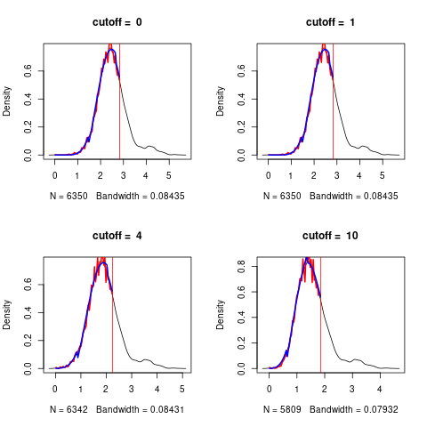

```{r setup, include=FALSE}
knitr::opts_chunk$set(fig.width=6, fig.height=6, dpi=300,echo = FALSE)
knitr::opts_chunk$set(fig.pos = "H", out.extra = "")

```


# Introduction


The objective of variable importance is essentially to perform variable selection. More precisely, it is possible to identify two final aims (Genuer et al., 2010): 

1. find a small number of variables with a maximized accuracy, or 
2. detect and rank all influential variables to focus on for interpretation and further exploration with domain experts. 


tuning

- mtry $\sqrt{p}$ for classification and $p/3$ for regression
- if there are only a few relevant variables out of many, which is the case in many genetic datasets, mtry should be set high, so that the algorithm can find the relevant 
variables (Goldstein, Polley, & Briggs, 2011). A large mtry ensures that there is (with high probability) at least one strong variable
in the set of mtry candidate variables.
- For high dimensional data they observe lower error rates for higher mtry values for both classification and regression, corroborating Goldstein et al. (2011).
-  Node size The nodesize parameter specifies the minimum number of observations in a terminal node. Setting it lower leads to trees with
a larger depth which means that more splits are performed until the terminal nodes. In several standard software packages the
default value is 1 for classification and 5 for regression.

# Simulation 1

We simulate a small data set with a covariance structure to explore the actions of **RFlocalfdr**.
This package implements an empirical Bayes method of determining a significance level for the Random Forest 
MDI (Mean Decrease in Impurity) variable importance measure. 
See @dunneThresholdingGiniVariable2022 for details.

We 

- simulate the data set
- fit a Random Forest model
- use RFlocalfdr to estimate the significant variables
- for comparison, we also estimate the significant variables using

   - Boruta (@Kursa.and.Rudnicki.2010)
   - Recursive Fearure Elimination
   - AIR (@Nembrini.et.al.2018)
   - PIMP (@Altmann.et.al.2010).


## setup
We plot a small data set of $300\times  508$ to explore the data generation method.
This dataset consist of _bands_, with _blocks_ of $\{1, 2, 4, 8, 16, 32, 64\}$ of
identical variables (see figure \@ref(fig:simulation2)). The variables are $\in \{0,1,2\}$, a common encoding for
genomic data where the numbers represent the number of copies of the minor allele. Only band 1 is used to calculate the
$y$ vector and $y$ is 1 if any of $X[, c(1, 2, 4, 8, 16, 32, 64)]$ is non-zero, so $y$ is unbalanced, containing more
1's than 0's. 


```{r eval=FALSE,echo=TRUE}
library(ranger)
library(RFlocalfdr)
library(caret)
library(pROC)

```
```{r ,  eval=FALSE,echo=FALSE}
packageDescription("RFlocalfdr")$GithubSHA1
#source("/home/dun280/Dropbox/R_libraries/RF_localfdr/RFlocalfdr/R/my.pimp.s")

```
```{r eval=FALSE,echo=TRUE}
set.seed(13)
num_samples <- 300
num_bands <- 4
band_rank <- 6
num_vars <- num_bands * (2 ** (band_rank+1) -1)
print(num_vars)

X <- matrix(NA, num_samples , num_vars)
set.seed(123)

temp<-matrix(0,508,3)
var_index <- 1
for(band in 1:num_bands) {
     for (rank in 0:band_rank) {
         for (i in 1:2**rank) {
           temp[var_index,]<-c(band , rank, var_index)
             var_index <- var_index +1 
         }
     }
}

#png("./supp_figures/small_simulated_data_set.png")
plot(temp[,1],ylim=c(0,10),type="p") 
lines(temp[,2],type="b",col="red")
legend(0,10,c("band","rank"),pch=1,col=c(1,2))
#dev.off()
abline(v=c( 1,  2 , 4 , 8 ,16 ,32, 64 ))

table(temp[temp[,1]==1,2])
## # 0  1  2  3  4  5  6 
## # 1  2  4  8 16 32 64


X <- matrix(NA, num_samples , num_vars)
set.seed(123)
  
var_index <- 1
for(band in 1:num_bands) {
    for (rank in 0:band_rank) {
#        cat("rank=",rank,"\n")
        var <- sample(0:2, num_samples, replace=TRUE)
        for (i in 1:2**rank) {
            X[,var_index] <- var
            var_index <- var_index +1 
        }
#        print(X[1:2,1:140])
#        system("sleep 3")
    }
}

y <- as.numeric(X[,1] > 1 |  X[,2] > 1  |  X[,4] > 1 |  X[,8] > 1 |  X[,16] > 1 | X[,32] > 1 | X[,64] > 1 )


data <- cbind(y,X)
colnames(data) <- c("y",make.names(1:num_vars))
    rfModel <- ranger(data=data,dependent.variable.name="y", importance="impurity",
                      classification=TRUE,  mtry=100,num.trees = 10000, replace=TRUE, seed  = 17 )
zz2 <-log(importance(rfModel))

plot(zz2,type="b",col=temp[,1]+1)

roccurve <- roc(c(rep(1,127),rep(0,508-127)),zz2)
plot(roccurve)
auc(roccurve) # 0.993

```

```{r simulation2, echo=FALSE, fig.cap="A small simulated data set. Each band contains blocks of size {1, 2, 4, 8, 16, 32, 64}, and each block consists of correlated (identical variables).", fig.align="center", out.width = '50%'}
knitr::include_graphics("./supp_figures/small_simulated_data_set.png")
``` 


## data
We now generate the data for the simulation. 
We have 50 bands and 300 observations so $X$ is $300 \times 6350$ with 127 non-null variables.  We fit a
standard RF to this dataset and record the resulting MDI importance score.

```{r eval=FALSE,echo=TRUE}
set.seed(13)
num_samples <- 300
num_bands <- 50
band_rank <- 6
num_vars <- num_bands * (2 ** (band_rank+1) -1)
print(num_vars)

X <- matrix(NA, num_samples , num_vars)
set.seed(123)
  
var_index <- 1
for(band in 1:num_bands) {
    for (rank in 0:band_rank) {
#        cat("rank=",rank,"\n")
        var <- sample(0:2, num_samples, replace=TRUE)
        for (i in 1:2**rank) {
            X[,var_index] <- var
            var_index <- var_index +1 
        }
#        print(X[1:2,1:140])
#        system("sleep 3")
    }
}

y <- as.numeric(X[,1] > 1 |  X[,2] > 1  |  X[,4] > 1 |  X[,8] > 1 |  X[,16] > 1 |
                X[,32] > 1 | X[,64] > 1 )

```

## Random forest
```{r eval=FALSE,echo=TRUE}
data <- cbind(y,X)
colnames(data) <- c("y",make.names(1:num_vars))

rfModel <- ranger(data=data,dependent.variable.name="y", importance="impurity",
             classification=TRUE,num.trees = 10000, mtry=100, seed  = 17 )

imp <-log(ranger::importance(rfModel))
t2 <-count_variables(rfModel)
plot(density(imp))

roccurve <- roc(c(rep(1,127),rep(0,6350-127)),imp)
plot(roccurve)
auc(roccurve) # 0.9912

palette("default")
col<-c(1, rep(2,2), rep(3,4), rep(4, 8), rep(5,16 ), rep(6,32 ), rep(7,64) )
plot(1:1016,imp[1:1016],type="p",col=rep(col,8),pch=16,cex=0.8,
     xlab="variable number",ylab="log importances")


```

We have set **num.trees** to a large value and **mtry** to a larger value than the default. This is because of the large number of varaibles.
\marginpar{refs for setting parameters for large p}


We plot the log importances for the first 8 bands (figure \@ref(fig:simulation2zz2). The plot for all 50 bands it too compressed.
The blocks are shown in different colors. The bias described by @Strobl.et.al.2007 is clearly visible.
Blocks 1 to 7 of band 1 should be of equal expected influence on $y$, but the importance is decreasing as the number of 
variables in the block is increased. 


```{r simulation2zz2, echo=FALSE, fig.cap="The log importances for the first 8 bands.", fig.align="center", out.width = '50%'}
knitr::include_graphics("./supp_figures/simulation2_zz2.png")

```

### Determine cutoff
```{r eval=FALSE,echo=TRUE}
cutoffs <- c(0,1,4,10)
#png("./supp_figures/simulated_data_determine_cutoff.png")
res.con<- determine_cutoff(imp,t2,cutoff=cutoffs,plot=c(0,1,4,10))
#dev.off()

``` 
We plot the kernel density estimate of the histogram of the data $y$, and the skew normal fit, $t_1$, using the data up to the
quantile $Q$, shown in red.

```{r , echo=FALSE, fig.cap="For this data set, the selected cutoff value is 0.", fig.align="center", out.width = '50%'}

```

```{r eval=FALSE,echo=TRUE}
plot(cutoffs,res.con[,3])
cutoffs[which.min(res.con[,3])]

```
By plotting $\max(|y - t_1|)$ versus the cutoff values, we determine the appropriate cutoff. In this case it is 
just $t2>0$


### Rflocalfdr
```{r eval=FALSE,echo=TRUE}
temp<-imp[t2 > 0]
palette("R3")

qq <- plotQ(temp,debug.flag = 1)
ppp<-run.it.importances(qq,temp,debug=0)
 aa<-significant.genes(ppp,temp,cutoff=0.05,do.plot=2)
length(aa$probabilities) # 95

tt1 <-as.numeric(gsub("X([0-9]*)","\\1",names(aa$probabilities)))
tt2 <- table(ifelse((tt1 < 127),1,2))
# 1  2 
# 59 36 
# The false discovery rate is 0.3789474
tt2[2]/(tt2[1]+tt2[2])
#59 36   36/(36+59) = 0.3789474

predicted_values<-rep(0, 6350);predicted_values[tt1]<-1
conf_matrix<-table(predicted_values,c(rep(1,127),rep(0,6350-127)))
conf_matrix
conf_matrix[2,1]/sum(conf_matrix[2,]) # 0.3789474 FDR 
sensitivity(conf_matrix) #0.994215 TP/(TP+FN)
specificity(conf_matrix) #0.4645669 TN/(FP+TN)

roccurve <- roc(c(rep(1,127),rep(0,6350-127)),predicted_values)
plot(roccurve)
auc(roccurve) #0.7294

accuracy<-(conf_matrix[1,1]+conf_matrix[2,2])/(sum(conf_matrix))
accuracy # 0.983622

```
The FDR is 0.379. We can also calculate the sensitivity, sensitivity and accruacy.


```{r eval=FALSE,echo=FALSE}
temp <- temp - min(temp) + .Machine$double.eps

palette(topo.colors(n = 7))
col<-c(1, rep(2,2), rep(3,4), rep(4, 8), rep(5,16 ), rep(6,32 ), rep(7,64) )

plot(1:127,temp[1:127],type="p",col=rep(col,2),pch=16,cex=0.8,
     xlab="variable number",ylab="log importances")


plot(1:1016,temp[1:1016],type="p",col=rep(col,8),pch=16,cex=0.8,
     xlab="variable number",ylab="log importances")
lines(1:1016,temp[1:1016],col = "gray62",lwd=0.5)

abline(h=3.699622,col="red")
abline(v=127,col="green")
legend("topright",legend=c("RFlocalfdr cutoff","non-null variables"),lty=1,col=c("red","green" ))

```


In  order to make the comparisons with other methods, the following packages may need to be installed.

```{r eval=FALSE,echo=TRUE}
install.packages("Boruta")
install.packages("locfdr")
install.packages("vita") 
install.packages("locfdr")
devtools::install_github("silkeszy/Pomona")

```

```{r eval=FALSE,echo=FALSE}
if (!require("BiocManager", quietly = TRUE))
    install.packages("BiocManager")
BiocManager::install("twilight")

```

## Boruta

We try the Boruta algorithm (@Kursa.and.Rudnicki.2010).

```{r eval=FALSE,echo=TRUE}
library(Boruta)
set.seed(120)  
boruta1 <- Boruta(X,as.factor(y),  num.threads = 7,getImp=getImpRfGini)
print(boruta1)
#Boruta performed 99 iterations in 19.54727 secs.
#4 attributes confirmed important: X4859, X58, X6132, X7;
# 6346 attributes confirmed unimportant: X1, X10, X100, X1000, X1001 and 6341 more;
plotImpHistory(boruta1)
aa <- which(boruta1$finalDecision=="Confirmed") 
bb <- which(boruta1$finalDecision=="Tentative") 
predicted_values <-rep(0,6350);predicted_values[c(aa,bb)]<-1
conf_matrix<-table(predicted_values,c(rep(1,127),rep(0,6350-127)))
conf_matrix

conf_matrix[2,1]/sum(conf_matrix[2,]) # 0.3789474 FDR 
sensitivity(conf_matrix) #0.9996786 TP/(TP+FN)
specificity(conf_matrix) #0.01574803 TN/(FP+TN)

roccurve <- roc(c(rep(1,127),rep(0,6350-127)),predicted_values)
plot(roccurve)
auc(roccurve) #0.5077

accuracy<-(conf_matrix[1,1]+conf_matrix[2,2])/(sum(conf_matrix))
accuracy #0.98

```
```{verbatim, eval=FALSE,echo=FALSE}
  D  !D
+ TP FP
- FN TN

- Sensitivity=[TP/(TP+FN)]×100
- Specificity=[TN/(FP+TN)]×100
- Positive predictive value(PPV)= [TP/(TP+FP)]×100
- Negative predictive value(NPV)=[TN/(FN+TN)]×100.
```


## Recursive Feature Elimination
This is provided by the package Pomona (@Pomona.2022)
```{r eval=FALSE,echo=TRUE}
library(Pomona)
colnames(X) <- make.names(1:dim(X)[2])
set.seed(111)
res <- var.sel.rfe(X, y, prop.rm = 0.2,  recalculate = TRUE, tol = 10, 
    ntree = 500, mtry.prop = 0.2, nodesize.prop = 0.1, no.threads = 7, 
    method = "ranger", type = "classification", importance = "impurity", 
    case.weights = NULL) 
 res$var
#[1] "X1"    "X106"  "X11"   "X12"   "X127"  "X13"   "X15"   "X16"   "X2"   
#[10] "X23"   "X24"   "X3"    "X4"    "X44"   "X46"   "X4885" "X5"    "X54"  
#[19] "X5474" "X6"    "X7"    "X72"   "X9"    "X91"  
tt <-as.numeric(gsub("X([0-9]*)","\\1", res$var))
table(ifelse((tt < 127),1,2))
# 1  2 
#21  3 0.0833

res<-c(1,106, 11, 12, 127, 13, 15, 16,  2, 23, 24,  3,  4, 44, 46,  4885,  5, 54, 5474,  6,  7, 72,  9, 91)
predicted_values <-rep(0,6350);predicted_values[c(res)]<-1
conf_matrix<-table(predicted_values,c(rep(1,127),rep(0,6350-127)))
conf_matrix
sensitivity(conf_matrix) # 0.9996786 TP/(TP+FN)
specificity(conf_matrix) #0 0.1732283 TN/(FP+TN)
roccurve <- roc(c(rep(1,127),rep(0,6350-127)),predicted_values)
plot(roccurve)
auc(roccurve) #0.5865
accuracy<-(conf_matrix[1,1]+conf_matrix[2,2])/(sum(conf_matrix))
accuracy #  0.9831496

```

## AIR

See @Nembrini.et.al.2018. AIR is provided in the package _ranger_, using the option _impurity_corrected_.
```{r eval=FALSE,echo=TRUE}
rfModel2 <- ranger(data=data,dependent.variable.name="y", importance="impurity_corrected",
       classification=TRUE,  mtry=100,num.trees = 10000, replace=TRUE, seed  = 17 )
ww<- importance_pvalues( rfModel2, method = "janitza")

p <- ww[,"pvalue"]
cc <- which(p< 0.05)  
predicted_values <-rep(0,6350);predicted_values[cc]<-1
conf_matrix<-table(predicted_values,c(rep(1,127),rep(0,6350-127)))
conf_matrix
#predicted_values    0    1
#               0 5950    0
#               1  273  127
#FDR is 273/(127+273) = 0.6825

sensitivity(conf_matrix) #0.9561305 TP/(TP+FN)
specificity(conf_matrix) #1          TN/(FP+TN)
roccurve <- roc(c(rep(1,127),rep(0,6350-127)),predicted_values)
plot(roccurve)
auc(roccurve) # 0.9781
accuracy<-(conf_matrix[1,1]+conf_matrix[2,2])/(sum(conf_matrix))
accuracy #  0.9570079

```
As the null values, as modelled bt the AIR procedure, are symmetric around 0, the
question arises as to whether we can apply the locfdr (@locfdr.2015) procedure.
In this case, it reduces the FDR from 0.682 to 0.601.


```{r eval=FALSE,echo=TRUE}
plot(density(ww[,"importance"]))
imp <- ww[,"importance"]
#imp <-imp/sqrt(var(imp))
#plot(density(imp))
library(locfdr)

aa<-locfdr(imp,df=13)
which( (aa$fdr< 0.05) & (imp>0))
cc2 <-  which( (aa$fdr< 0.05) & (imp>0))
length(cc2) # [1] 309
length(intersect(cc,cc2)) #[1] 309

(length(cc2)  - length(which(cc2 <= 127)))/length(cc2) #[1] 0.6019417  fdr
predicted_values <-rep(0,6350);predicted_values[cc2]<-1
conf_matrix<-table(predicted_values,c(rep(1,127),rep(0,6350-127)))
conf_matrix
sensitivity(conf_matrix) # 0.9701109 TP/(TP+FN)
specificity(conf_matrix) #0.9685039         TN/(FP+TN)
roccurve <- roc(c(rep(1,127),rep(0,6350-127)),predicted_values)
plot(roccurve)
auc(roccurve) # 0.9693
accuracy<-(conf_matrix[1,1]+conf_matrix[2,2])/(sum(conf_matrix))
accuracy #   0.9700787

```

## PIMP


note that PIMP

- permutes the response vector $y$ $S$ times to give $y^{*s}$
- For each permutation, a new RF is grown and the permutation
  variable importance measure (VarImp$^{*s}$) for all predictor variables X is computed. 
- The vector ‘perVarImp’ of $S$ VarImp measures for every predictor variable is  used to approximate the null importance distributions
   for each variable  (see **PimpTest**)
- we are doing $p$ tests, hence a multiple testing correction is in order
- we base our work on the  PIMP implementation provided by  @vita.2015 _Variable Importance Testing Approaches_ 
- pump as described by Altman is only applicable to permutation importance.
- however we see no impediment in extending the method to Gini importance
- we have done that in our code and also 

    - fixed a small error
	- extended the code to use **ranger** as well as **randomForest** implementations of RF 

```{r eval=FALSE,echo=TRUE}
#vita: Variable Importance Testing Approaches
library(vita) 
y<-factor(y)
X<-data.frame(X)
set.seed(117)
cl.ranger <- ranger(y~. , X,mtry = 3,num.trees = 1000, importance = 'impurity') #was this a classification model? check
system.time(pimp.varImp.cl<-my_ranger_PIMP(X,y,cl.ranger,S=10, parallel=TRUE, ncores=3)) #was this a classification 
pimp.t.cl <- vita::PimpTest(pimp.varImp.cl,para = FALSE)
aa <- summary(pimp.t.cl,pless = 0.1)

tt<-as.numeric(gsub("X([0-9]*)","\\1",  names(which(aa$cmat2[,"p-value"]< 0.05))))
table(ifelse((tt < 127),1,2))
# 1  2 
# 38 527      527 /(527+38) = 00.9327434

predicted_values <-rep(0,6350);predicted_values[which(aa$cmat2[,"p-value"]< 0.05)]<-1
conf_matrix<-table(predicted_values,c(rep(1,127),rep(0,6350-127)))
conf_matrix
sensitivity(conf_matrix) #0.9154749 TP/(TP+FN)
specificity(conf_matrix) #0.3070866          TN/(FP+TN)
roccurve <- roc(c(rep(1,127),rep(0,6350-127)),predicted_values)
plot(roccurve)
auc(roccurve) #  0.6113
accuracy<-(conf_matrix[1,1]+conf_matrix[2,2])/(sum(conf_matrix))
accuracy # 0.9033071
```

```{r eval=FALSE,echo=FALSE}
# twilight uses a stochastic downhill search algorithm for estimating the local false discovery rate
library(twilight)
p.values <- aa$cmat2[,"p-value"]
ans <- twilight(p.values)
fdr <- ans$result$fdr
sum(fdr < 0.05) #[1] 0

```

```{r eval=FALSE,echo=FALSE}
#how to make a neat html table in Rmarkdown
library(tables)
X <- rnorm(125, sd=100)
Group <- factor(sample(letters[1:5], 125, rep=TRUE))
tab <- tabular( Group ~ (N=1)+Format(digits=2)*X*((Mean=mean) + Heading("Std Dev")*sd) )
table_options(knit_print = FALSE)
tab        # This chunk uses the default results = 'markup'

toHTML(tab)  # This chunk uses results = 'asis'
table_options(CSS =
"<style>
#ID .center { 
  text-align:center;
  background-color: aliceblue;
} 
</style>", doCSS = TRUE)
tab
table_options(doCSS = FALSE)
```
\clearpage

## Conclusion

```{r table3, echo=FALSE, message=FALSE, warnings=FALSE, results='asis'}
tabl <- "
    Method     | true positives | false positives | Sensitivity | Speficity | FDR | AUC |
                      select variables based on RF
    RFlocalfdr | 59             | 36              | 0.99         | 0.46 | 0.378   |0.73  |
    Boruta     | 2              | 2               | 0.99         |0.016 | 0.5     |0.51  |
    RFE        | 22             | 2               | 0.99         |      | 0.58           |
    AIR        | 176            | 273             | 0.96         |      | 0.98           |
    AIR+locfdr | 123            | 186             | 0.97         |      | 0.97           |
    PIMP       | 39             | 556             | 0.91         |      | 0.61           |

                  rank variables
    RF impurity|                |                 |              |      | 0.993          |
    cforest    |                |                 |              |      | 0.9486         |
    SobolMDA   |                |                 |              |      | 0.9954         |
    Shaff      | 1              | 0               |              |      |                |
   fastshap    |                |                 |              |      | *              |
   iml Shapley |                |                 |              |      | *              |

--------------------------------------------------------------------------- 
"
cat(tabl) # output the table in a format good for HTML/PDF/docx conversion

```


Performance of variable selection for the simulated example by several methods. The best outcomes for each category are in bold face.
RFE has performed better than Boruta but apart from that, ordering the methods will depend on the cost of false positives versus the cost of false negatives.


<!-- How do I get boldface in a table? neither  **0.99**  or  $\textbf{0.99}$ work -->

<!-- tabular( -->
<!-- \begin{table}[tbhp] -->
<!--   \centering -->
<!--   \begin{tabular}{||p{2cm}|l|l|l|l|l|l|l||} -->
<!--     \hline -->
<!--     Method     & true positives & false positives & Sensitivity & AUC  \\ -->
<!--     \hline -->
<!--     RFlocalfdr & 59             & 36              & \textbf{0.99}       & 0.73 \\ -->
<!--     Boruta     & 2              & 2               & \textbf{0.99}        & 0.50 \\ -->
<!--     RFE        & 22             & 2               & \textbf{0.99}        & 0.58 \\ -->
<!--     AIR        & 176            & 273             & 0.96        & \textbf{0.98} \\ -->
<!--     PIMP       & 39             & 556             & 0.91        & 0.61 \\ -->
<!--     \hline -->
<!--   \end{tabular} -->
<!--   \caption{Performance of variable selection for the simulated example by several methods. The best outcomes for each -->
<!--     category are in bold face. -->
<!--   %RFE has performed better than Boruta but apart from that, ordering the methods will depend on the cost of false positives versus the cost of false negatives. -->
<!--   } -->
<!--   \label{table:simulation_results} -->
<!-- \end{table} -->
<!-- ) -->


<!-- ```{r table4, echo=FALSE, message=FALSE, warnings=FALSE, results='asis'} -->
<!-- tabl <- " -->
<!--     Method     | true positives | false positives | FDR  | Sensitivity|specificity | AUC   | -->
<!--     RFlocalfdr | 59             | 36              | 0.38  | 0.99       |  *         | 0.73  | -->
<!--     Boruta     | 2              | 2               | *    | 0.99       |  *         | 0.50  | -->
<!--     RFE        | 22             | 2               | 0.08  | 0.99       |  *         | 0.58  | -->
<!--     AIR        | 176            | 273             | 0.68  | 0.96       |  *         | 0.98  | -->
<!--     AIR+locfdr | 123             | 186             | 0.61  | 0.97       | 0.97        | 0.97  | -->
<!--     PIMP       | 39             | 556             | 0.93  | 0.91       |  *         | 0.61  | -->
<!-- ---------------------------------------------------------------------------  -->
<!-- " -->
<!-- cat(tabl) # output the table in a format good for HTML/PDF/docx conversion -->

<!-- ``` -->


# Other Methods

## permutation importance

```{R, echo=TRUE, eval=FALSE}
rfModel2 <- ranger(data=data,dependent.variable.name="y", importance="permutation",
             classification=TRUE,  mtry=100,num.trees = 10000, replace=TRUE, seed  = 17 )
imp <-ranger::importance(rfModel2)
plot(density(imp))

palette(topo.colors(n = 7))
plot(1:1016,imp[1:1016],type="p",col=rep(col,2),pch=16,cex=0.8,
     xlab="variable number",ylab="log importances")
lines(1:1016,imp[1:1016],col = "gray62",lwd=0.5)

abline(v=127,col="green")
#legend("topright",legend=c("RFlocalfdr cutoff","non-null variables"),lty=1,col=c("red","green" ))

# could apply Briemans and Cutlers argument that the permutation importance is Gaussian --
# or could use empirical Bayes

```
## impurity corrected

```{R, echo=TRUE, eval=FALSE}
rfModel3 <- ranger(data=data,dependent.variable.name="y", importance="impurity_corrected",
             classification=TRUE,  mtry=100,num.trees = 10000, replace=TRUE, seed  = 17 )
imp <-ranger::importance(rfModel3)
plot(density(imp))

palette(topo.colors(n = 7))
plot(1:1016,imp[1:1016],type="p",col=rep(col,2),pch=16,cex=0.8,
     xlab="variable number",ylab="log importances")
lines(1:1016,imp[1:1016],col = "gray62",lwd=0.5)

abline(v=127,col="green")
legend("topright",legend=c("RFlocalfdr cutoff","non-null variables"),lty=1,col=c("red","green" ))

```


## cforest

It appears that 
On this modest

The permimp-package is developed to replace the Conditional Permutation Importance (CPI) computation by the
varimp-function(s) of the party-package. permimp applies a different implementation for the CPI, in order to mitigate
some issues related to the implementation of the CPI in the party-package. In addition, the CPI is also available for
random forests grown by the randomForest-package. Finally, the package includes some plotting options.


```{R, echo=TRUE, eval=FALSE}
library(party)
library(permimp) #

#The permimp-package is developed to replace the Conditional Permutation Importance (CPI) computation by the
#varimp-function(s) of the party-package. permimp applies a different implementation for the CPI, in order to mitigate
#some issues related to the implementation of the CPI in the party-package. In addition, the CPI is also available for
#random forests grown by the randomForest-package. Finally, the package includes some plotting options.

data <- data.frame(y,X)
system.time(mod1.cf <- party::cforest(y ~ ., data = data, 
                                   control = party::cforest_unbiased(ntree = 10,  mtry = 100)))
# 27.386   0.000  27.412 
system.time(aa<-party::varimp(mod1.cf, conditional = TRUE))
#    user   system  elapsed 
#3089.301    9.484 3100.554

system.time(mod1.cf <- party::cforest(y ~ ., data = data, 
                                   control = party::cforest_unbiased(ntree = 100,  mtry = 100)))
#  27.233   0.464  27.703 
system.time(aa<-party::varimp(mod1.cf, conditional = TRUE))
#    user   system  elapsed 
#29380.980    81.511 29475.138 
save(aa,file="aa.Rdata")

system.time(aa3<-permimp(mod1.cf, conditional = FALSE))
#  user  system elapsed 
#10.015   0.180  10.254

system.time(mod1.cf <- party::cforest(y ~ ., data = data, 
                                   control = party::cforest_unbiased(ntree = 1000,  mtry = 100)))


system.time(mod1.cf <- party::cforest(y ~ ., data = data, 
                                   control = party::cforest_unbiased(ntree = 1000,  mtry = 100)))
#35.438   0.636  36.095 

system.time(aa4<-permimp(mod1.cf, conditional = FALSE))
#  user  system elapsed 
# 47.135   0.429  47.578 


palette("default")
col<-c(1, rep(2,2), rep(3,4), rep(4, 8), rep(5,16 ), rep(6,32 ), rep(7,64) )
plot(1:1016,aa4$values[1:1016],type="p",col=col,pch=16,cex=0.8,
      xlab="variable number",ylab="log importances")

system.time(mod1.cf <- party::cforest(y ~ ., data = data, 
                                   control = party::cforest_unbiased(ntree = 10000,  mtry = 100)))
#35.438   0.636  36.095 

system.time(aa4<-permimp(mod1.cf, conditional = FALSE))
#  user  system elapsed 
# 47.135   0.429  47.578


roccurve <- roc(c(rep(1,127),rep(0,6350-127)),aa4$values)
plot(roccurve)
auc(roccurve) #0.9486

system.time(mod1.cf <- party::cforest(y ~ ., data = data, 
                                    control = party::cforest_unbiased(ntree = 10000,  mtry = 100)))
#Process R killed at Mon Feb 26 07:18:23 2024


```
## sobolMDA
@benardMDARandomForests2022

```{R, echo=FALSE, eval=FALSE}
library(sobolMDA)
data <- data.frame(y,X)
system.time(rng.sobolmda <- sobolMDA::ranger(dependent.variable.name = "y", classification = TRUE, data = data, mtry = 100, num.trees = 10000, importance = "sobolMDA",
                                             seed = 125, replace = FALSE))


palette("default")
col<-c(1, rep(2,2), rep(3,4), rep(4, 8), rep(5,16 ), rep(6,32 ), rep(7,64) )
plot(1:1016,rng.sobolmda$variable.importance[1:1016],type="p",col=col,pch=16,cex=0.8,
      xlab="variable number",ylab="log importances")


roccurve <- roc(c(rep(1,127),rep(0,6350-127)),rng.sobolmda$variable.importance)
plot(roccurve)
auc(roccurve) #0.9954


```

```{R, echo=FALSE, eval=FALSE}
# example from  Variable Importance in Random Forests: Traditional Methods and New Developments
#https://towardsdatascience.com/variable-importance-in-random-forests-20c6690e44e0

library(kernlab)
library(drf) #An implementation of distributional random forests as introduced in Cevid & Michel & Meinshausen & Buhlmann (2020) 
library(Matrix)
library(DescTools)
library(mice)
library(sobolMDA)
source("./simulated2/compute_drf_vimp.R") 
source("./simulated2/evaluation.R")


##Simulate Data that experiences both a mean as well as sd shift
n <- 200
# Simulate from X
x1 <- runif(n,-1,1)
x2 <- runif(n,-1,1)
X0 <- matrix(runif(7*n,-1,1), nrow=n, ncol=7)
x3 <- x1+ runif(n,-1,1)
X <- cbind(x1,x2, x3, X0)

# Simulate dependent variable Y
Y <- as.matrix(rnorm(n,mean = 0.8*(x1 > 0), sd = 1 + 1*(x2 > 0)))
colnames(X)<-paste0("X", 1:10)

head(cbind(Y,X))


Xfull <-X
## Variable importance for conditional Expectation Estimation
XY <- as.data.frame(cbind(Xfull, Y))
colnames(XY) <- c(paste('X', 1:(ncol(XY)-1), sep=''), 'Y')
num.trees <- 500
forest <- sobolMDA::ranger(Y ~., data = XY, num.trees = num.trees, importance = 'sobolMDA') #was this a classification model? check
sobolMDA <- forest$variable.importance
names(sobolMDA) <- colnames(X)

sort(sobolMDA, decreasing = T)


forest <- sobolMDA::ranger(Y ~., data = XY, num.trees = num.trees, importance = 'permutation')
MDA <- forest$variable.importance
names(MDA) <- colnames(X)
sort(MDA, decreasing = T)

MMDVimp <- compute_drf_vimp(X=X,Y=Y)
sort(MMDVimp, decreasing = T)


load("~/Downloads/wage_benchmark.Rdata")
##Define the training data

n<-1000

Xtrain<-X[1:n,] 
Ytrain<-Y[1:n,]
Xtrain<-cbind(Xtrain,Ytrain[,"male"])
colnames(Xtrain)[ncol(Xtrain)]<-"male"
Ytrain<-Ytrain[,1, drop=F]


##Define the test data
ntest<-2000
Xtest<-X[(n+1):(n+ntest),]  
Ytest<-Y[(n+1):(n+ntest),]
Xtest<-cbind(Xtest,Ytest[,"male"])
colnames(Xtest)[ncol(Xtest)]<-"male"
Ytest<-Ytest[,1, drop=F]

# Calculate variable importance for both measures
# 1. Sobol-MDA
XY <- as.data.frame(cbind(Xtrain, Ytrain))
colnames(XY) <- c(paste('X', 1:(ncol(XY)-1), sep=''), 'Y')
num.trees <- 500
forest <- sobolMDA::ranger(Y ~., data = XY, num.trees = num.trees, importance = 'sobolMDA')
SobolMDA <- forest$variable.importance
names(SobolMDA) <- colnames(Xtrain)

# 2. MMD-MDA
MMDVimp <- compute_drf_vimp(X=Xtrain,Y=Ytrain,silent=T)


print("Top 10 most important variables for conditional Expectation estimation")
sort(SobolMDA, decreasing = T)[1:10]
print("Top 5 most important variables for conditional Distribution estimation")
sort(MMDVimp, decreasing = T)[1:10]

# Remove variables one-by-one accoring to the importance values saved in SobolMDA
# and MMDVimp.
evallistSobol<-evalall(SobolMDA, X=Xtrain ,Y=Ytrain ,Xtest, Ytest, metrics=c("MSE"), num.trees )
evallistMMD<-evalall(MMDVimp, X=Xtrain ,Y=Ytrain ,Xtest, Ytest, metrics=c("MMD"), num.trees )    #slow

plot(1:79,evallistSobol$evalMSE, type="l", lwd=2, cex=0.8, col="darkgreen", main="MSE and (MMD+0.8) loss" , xlab="Number of Variables removed", ylab="Values")
lines(1:79,evallistMMD$evalMMD+0.8, type="l", lwd=2, cex=0.8, col="blue")

#Random Forests in 2023: Modern Extensions of a Powerful Method
#https://towardsdatascience.com/random-forests-in-2023-modern-extensions-of-a-powerful-method-b62debaf1d62

```


# Shap values

The Shapley value is defined for any value
function and SHAP is a special case of the Shapley value by taking the function to be the conditional
expectation function of our model.  A SHAP value is the average marginal contribution of a feature value across all possible sets of features.

-  the very fast TreeSHAP is an algorithm to compute SHAP values for tree ensemble models such as decision trees, random forests, and
    gradient boosted trees in a polynomial-time proposed by @lundbergConsistentIndividualizedFeature2019
- the R library *treeshap* only accepts regression models (not classification)
- other options 
   
   - *fastshap* uses Monte-Carlo sampling to approximate SHAP values, 
   -  *shapr* and *kernelshap* provide implementations of KernelSHAP. 
   - shapper A port to Python’s “shap” package is provided in shapper
   
Global explanations
Aside from explaining individual prediction (i.e., local explanation), it can be useful to aggregate the results of
several (i.e., all of the training predictions) into an overall global summary about the model (i.e., global
explanations). 


## SHAFF: Fast and consistent SHApley eFfect estimates via random Forests

@benardSHAFFFastConsistent2022

1.  improve the Monte-Carlo approach by using importance sampling to focus on the most relevant subsets of variables identified by the forest.
2. uses a projected random forest algorithm to compute fast and accurate estimates of the conditional expectations for any variable subset (same algorithm as SobolMDA?)
3. initial forest sets **mtry** to $p/3$, much larger than we are using
Finds one variable.


```{R, echo=FALSE, eval=FALSE}
# devtools::install_gitlab("drti/shaff")
library(shaff)
library("nnls") #needs this but does not load it
data <- cbind(y,X)
names(data)[1] <- "Y"
system.time(rng <- shaff(data = data, mtry = 100, num.trees = 10000, K=500))
which(rng>0)
#[1] 17

```

## iml: Interpretable Machine Learning

- See @Molnar.2021
-  did not finish in 3 hours (20 processors but seems to be only using 1, can we make it parallel)


```{R, echo=FALSE, eval=FALSE} 
library(iml)
library(ranger)
set.seed(314)
data <- data.frame(y,X)
rfModel2 <- ranger(data=data,dependent.variable.name="y", importance="permutation",
             classification=TRUE,  mtry=100,num.trees = 10, replace=TRUE, seed  = 17 )
X <- data.frame(data[,-which(names(data) == "y")])
mod <- Predictor$new(rfModel2, data = X, type = "response")
shapley <- Shapley$new(mod, x.interest = X[1, ]) #killed -- using a lot of RAM 
plot(shapley)


```

## mlr3

## fastshap

- https://bgreenwell.github.io/fastshap/articles/fastshap.html
- did not finish in 2 1/2 hours with 20 processors 

```{R, echo=FALSE, eval=FALSE}
#Source: vignettes/fastshap.Rmd

library(fastshap)
library(ranger)
set.seed(2053)  # for reproducibility

pfun <- function(object, newdata) {
  predict(object, data = newdata)$predictions
}

library(doParallel)

# With parallelism
#salloc --account=OD-225217 --mem=100GB --nodes=1 --ntasks-per-node=1  --cpus-per-task=20  -J interactive -t 6:00:00 srun --pty /bin/bash -l

registerDoParallel(cores = 20)  # use forking 
set.seed(5038)
system.time({  # estimate run time
  ex.ames.par <- explain(rfModel2, X = X, pred_wrapper = pfun, nsim = 50, adjust = TRUE, parallel = TRUE)
})


```

## ShapleyVIC

- this is the **R** stand alone version which is not leagacy code. I have not used the newer versions that use both **Python** and **R**


```{R, echo=FALSE, eval=FALSE}
library(ShapleyVIC)
packageDescription("ShapleyVIC")
"1.0.1"


```


\FloatBarrier

# simulation 2

For uncorrelated regressors, Strobl et al. (2007) demonstrated that variable importance metrics in RF-CART are biased
under relevant circumstances and introduced a different type of forest which does not exhibit this bias in the
uncorrelated regressor situations they simulated. For correlated regressors, Strobl et al. (2008) found that the
proposed solution of Strobl et al. (2007) does not solve all issues. They proposed “conditional variable
importance” as a modification to the algorithm for determining variable importance in random forests


@Strobl.et.al.2008 shows a simulation with the data generated according to a linear model with twelve predictor
variables $y = \beta_1 x_1+ \ldots + \beta_{12}x_{12} +\epsilon$ , with $\epsilon \sim N(0,0.5)$. The predictor
variables were sampled from a multivariate normal distribution $X_1,\ldots, X_{12} \sim N(0,\Sigma)$ where the
covariance structure $\Sigma$ was chosen such that all variables have unit variance $\sigma_j, j= 1,\ldots, 12$ and the
first four predictor variables are block-correlated with
$\sigma_{j,j^\prime} = 0.9 \textrm{ for } j \neq j^{\prime} \leq 4$, while the rest were independent with
$\sigma_{j,j^\prime} =0$. The coefficients of the linear generating model were $\{5, 5, 2, 0, -5, -5, -2, 0 ,0,0,0,0\}$.
Figure  \@ref(fig:Strobl2008Fig1) shows the results reproduced from @Strobl.et.al.2008. 

The issue that @Strobl.et.al.2008 identifies is that variables $X_3$ and $X_4$ have the same relationship with $y$ (up to sign) as $X_7$ and $X_8$, but
are are selected more frequently due to being correlated with $\{X_1,X_2\}$.

@Strobl.et.al.2008 uses a forest made with conditional inference trees, (see @hothorn_unbiased_2006, @Hothorn.and.Zeileis.2015). 
In addition @Strobl.et.al.2008's argument is based on
the frequency with which a variable is selected for splitting, not the variable importance.
Figure \ref{figure:cforest_stobel_reproduce_simulation }
shows our reproduction of these results (using \texttt{cforest}).


We first show that the simulation
leads to the same results with a standard forest algorithm and with variable importance. \marginpar{Gini, permutation?}
the problem is there for 

- importance="impurity",replace =TRUE (bootstrap) and
- importance="impurity",replace =FALSE (subsample) and
- importance="premutation",replace =TRUE (bootstrap) and
- importance="premutation",replace =FALSE (subsample) and
- importance="impurity_corrected",replace =TRUE (bootstrap) and
- importance="impurity_corrected",replace =FALSE (subsample) and


See figures:

- Figure \@ref(fig:lmStroblsimulationpng) -- A linear model recovers the variable importances very well. @gromping_variable_2009
- figure \ref{figure:cforest_Strobl_simulation_importances.png} shows the variable importances from our implementation of the simulation,
  using \texttt{cforest}. This is only a single run, not an average over multiple runs. 

   -  As expected, variable importance  (permutation) shows the same pattern as variable selection frequency. 
   - @Strobl.et.al.2008 introduces an unfortunately named ``conditional variable importance'' that is really quite
  separate to the conditional inference tree. This measure of variable importance shows the same pattern.

-  figure \ref{figure:ranger_mtry8_Strobl_simulation.png} shows the \@Strobl.et.al.2008 simulation using a
  standard tree algorithm (ranger). We note:

   - $X_3$ and  $X_4$ have much higher importances than $X_7$ and  $X_8$. The effect seems even more pronounced with
    a Gini split (and Gini importance) tree
  -  $\{X_1,X_2,X_3,X_4\}$ are much higher than  $\{X_5,X_6,X_7,X_8\}$ -- \textbf{why is this? should we average over
      multiple data sets?} This looks neither like the effect from Strobl or the Piotr effect
  -   all of the variables are selected as split variables.  -- \marginpar{include example to explain this}


```{r Strobl2008Fig1, echo=FALSE, fig.cap="Reproduced from @Strobl.et.al.2008. Relative selection rates for twelve variables in the first splits (left) and in all splits (right) of all trees in random forests built with different values for mtry. The issue that @Strobl.et.al.2008 identifies is that variables $X_3$ and $X_4$ have the same relationship with $y$ (up to sign) as $X_7$ and $X_8$, but are are selected more frequently due to being correlated with $\\{X_1,X_2\\}$.", fig.align="center", out.width = '50%'}
knitr::include_graphics("./script14/12859_2008_Article_2292_Fig1_HTML.jpg")
```

\begin{figure}[htbp]
  \begin{subfigure}[t]{0.5\linewidth}
    \centering
    \includegraphics[totalheight=5cm,width=0.8\linewidth]{./script14/mtry1_first_split.png}
    \caption{mtry=1, first split}
      \label{figure:colonoscopies_vs_SE_score.png} 
    \vspace{4ex}
  \end{subfigure}%%
  \hspace{4ex}
  \begin{subfigure}[t]{0.5\linewidth}
    \centering
    \includegraphics[totalheight=5cm,width=0.8\linewidth]{./script14/mtry1_all_splits.png}
    \caption{mtry=1, all splits}
     \label{figure:mortality_vs_services.png}
    \vspace{4ex}
  \end{subfigure}
  \vskip0.5cm
  \begin{subfigure}[t]{0.5\linewidth}
    \centering 
    \includegraphics[totalheight=5cm,width=0.8\linewidth]{./script14/mtry4_first_split.png}
    \caption{mtry=4, first split}
     \label{figure:barplot_male_tests.png} 
    \vspace{4ex}
  \end{subfigure}%%
  \hspace{4ex}
  \begin{subfigure}[t]{0.5\linewidth}
    \centering
    \includegraphics[totalheight=5cm,width=0.8\linewidth]{./script14/mtry4_all_splits.png}
    \caption{mtry=4, all splits.}
     \label{figure:self_screening_rates.pngs} 
    \vspace{4ex}
  \end{subfigure}
  \vskip0.5cm
  \begin{subfigure}[t]{0.5\linewidth}
    \centering 
    \includegraphics[totalheight=5cm,width=0.8\linewidth]{./script14/mtry8_first_split.png}
     \caption{mtry=8, first split}
     \label{figure:barplot_male_tests} 
    \vspace{4ex}
  \end{subfigure}%%
  \hspace{4ex}
  \begin{subfigure}[t]{0.5\linewidth}
    \centering
    \includegraphics[totalheight=5cm,width=0.8\linewidth]{./script14/mtry8_all_splits.png}
    \caption{mtry=8, all splits. }
   \label{figure:self_screening_rates} 
    \vspace{4ex}
  \end{subfigure}
  \caption{We implemented the simulation of \cite{Strobl.et.al.2008} with \texttt{cforest} and recorded the variable selection
    frequencies. This should match the figure \ref{figure:Strobl2008Fig1}.}
  \label{figure:cforest_stobel_reproduce_simulation }
\end{figure}


```{r lmStroblsimulationpng, echo=FALSE, fig.cap="The absolute value of the coefficients from a linear model fitted to the @Strobl.et.al.2008 simulation data. The linear model is successful in recovering the generative model coefficients {5, 5, 2, 0, -5, -5, -2, 0,0,0,0,0}. The fact that variables 1-4 are correlated and 5-8 are uncorrelated has not greatly affected the fitted coefficients.", fig.align="center", out.width = '50%'}
knitr::include_graphics("./script14/lm_Strobl_simulation.png")

```


\begin{figure}[tbhp]
	\begin{subfigure}{0.5\textwidth}
	\includegraphics[totalheight=7.45cm]{./script14/varimp_cf1.png}
	\caption{varimp cf1.png}
	\label{subfigure:a}
	\end{subfigure}
	\begin{subfigure}{0.5\textwidth}
\includegraphics[totalheight=7.45cm]{./script14/conditional_varimp_cf1.png}
	\caption{conditional varimp cf1.png}\label{subfigure:c}
	\end{subfigure}
	\begin{subfigure}{0.5\textwidth}
	\includegraphics[totalheight=7.45cm]{./script14/varimp_cf4.png}
	\caption{varimp cf4.png}\label{subfigure:b}
	\end{subfigure}
	\begin{subfigure}{0.5\textwidth}
\includegraphics[totalheight=7.45cm]{./script14/conditional_varimp_cf4.png}
	\caption{conditional varimp cf4.png}\label{subfigure:c2}
	\end{subfigure}
	\begin{subfigure}{0.5\textwidth}
\includegraphics[totalheight=7.45cm]{./script14/varimp_cf8.png}
	\caption{varimp cf8.png}\label{subfigure:c3}
	\end{subfigure}
	\begin{subfigure}{0.5\textwidth}
\includegraphics[totalheight=7.45cm]{./script14/conditional_varimp_cf8.png}
	\caption{conditional varimp cf8.png}\label{subfigure:c4}
	\end{subfigure}
	\caption{The variable importances for the \protect{\cite{Strobl.et.al.2008}} using a conditional independence forest (cforest)
and both the permutation importance and the conditional importance. The rows show reults for \texttt{mtry} = $\{$1,4, and $\}$.}    
	\label{figure:cforest_Strobl_simulation_importances.png}
	\end{figure}


\begin{figure}[tbhp]
\begin{subfigure}{\textwidth}
\includegraphics[totalheight=7.4cm]{./script14/ranger_mtry8_Strobl_simulation_importance_impurity.png}
\caption{}
\label{subfigure:ranger_mtry8_Strobl_simulation_a}
\end{subfigure}
\begin{subfigure}{\textwidth}
\includegraphics[totalheight=7.4cm]{./script14/ranger_mtry8_Strobl_simulation_importance_permutation.png}
\caption{}\label{subfigure:ranger_mtry8_Strobl_simulation_b}
\end{subfigure}
\begin{subfigure}{\textwidth}
 \includegraphics[totalheight=7.4cm]{./script14/mtry8_Strobl_simulation.png}
\caption{}\label{subfigure:ranger_mtry8_Strobl_simulation_c}
\end{subfigure}
\caption{The \protect{\cite{Strobl.et.al.2008}} simulation using a standard tree algorithm (ranger).
  \ref{subfigure:ranger_mtry8_Strobl_simulation_a} shows the Gini impurity importance,
  \ref{subfigure:ranger_mtry8_Strobl_simulation_b} shows the permutation importance and \ref{subfigure:ranger_mtry8_Strobl_simulation_c} shows the
  variable selection frequency.}
\label{figure:ranger_mtry8_Strobl_simulation.png}
\end{figure}


## issues
\begin{itemize}
\item Figure \ref{figure:piotr_party} shows how the conditional, inference tree performs on this problem. Comparing figures
 \@ref(fig:simulation2zz2) and \ref{subfigure:piotr_party_b} we see that the conditional inference tree does not
 give the same variable importance to sets of correlated (identical variables). \textit{not sure why this is the
 case. As it caluclates the association (correlation?) between $y$ and each $X_i$ to pick a split variable, as the
 variables are identical they should have the same association.}
\end{itemize}


```{R, echo=FALSE, eval=FALSE}
#set up the data for @Strobl.et.al.2008 
library(mvtnorm)
library(party)
library(ranger)
sigma <- diag(rep(1,12))
sigma[(row(sigma)<= 4) &(col(sigma) <= 4) &(row(sigma) != col(sigma))] <- 0.9
 
set.seed(123)
X<-mvtnorm:::rmvnorm(n=500, mean=rep(0,12), sigma=sigma, method="chol")
colMeans(X)
image(var(X))
plot(X[,5],X[,6])
#{x_1 ,x_2, x_3 ,x_4} are correlated

aa<-c(5, 5, 2, 0, -5, -5, -2, 0 ,0,0,0,0)
y<-X %*% aa
X<-data.frame(y,X)
```

```{R, echo=FALSE, eval=FALSE}
col<- c(rep("grey50",4),rep("grey80",8))
barplot(abs((lm(y~. ,data=X))$coeff[-1]),col=col)

```


```{R, echo=FALSE, eval=FALSE}
# reproduce figure ** 
#library(party)  -- does not seem to have a way of getting information about the splits
library(partykit)       #Conditional Random Forests

selection.rates<-function(forest){
    first.split<-c()
    all.splits<-c()
    for ( i in 1:500){
        tt<-gettree(forest,i)
        tt<-unlist(nodeapply(tt, ids = nodeids(tt), FUN = function(n) n$split$varid))
        first.split<-c(first.split, tt[1])
        all.splits<-c(all.splits,  tt)
    }
    first.split <- table(factor(first.split,levels=2:13))
    all.splits <- table(factor( all.splits,levels=2:13))
    list( first.split,all.splits)
}

set.seed(222)
cf1<-cforest(y ~ ., data = X,mtry=1,cores=1)
#cf1<-cforest(y ~ ., data = X,mtry=1,cores=6)
#this does not guarantee that the result is reproducible 

temp <- temp.mtry1 <-selection.rates(cf1)

#png("./script14/mtry1_first_split.png")
barplot(temp[[1]]/sum(temp[[1]]), names.arg =1:12,col=col)
#dev.off()

#png("./script14/mtry1_all_splits.png")
barplot(temp[[2]]/sum(temp[[2]]), names.arg =1:12,col=col)
#dev.off()

#
cf4<-cforest(y ~ ., data = X,mtry=4)
temp <- temp.mtry4 <-selection.rates(cf4)
#png("./script14/mtry4_first_split.png")
barplot(temp[[1]]/sum(temp[[1]]), names.arg =1:12,col=col)
#dev.off()
#png("./script14/mtry4_all_splits.png")
barplot(temp[[2]]/sum(temp[[2]]), names.arg =1:12,col=col)
#dev.off()

#
cf8<-cforest(y ~ ., data = X,mtry=8)
temp <- temp.mtry8 <-selection.rates(cf8)
#png("./script14/mtry8_first_split.png")
barplot(temp[[1]]/sum(temp[[1]]), names.arg =1:12,col=col)
#dev.off()
#png("./script14/mtry8_all_splits.png")
barplot(temp[[2]]/sum(temp[[2]]), names.arg =1:12,col=col)
#dev.off()

#save(cf1,  cf4,cf8,temp.mtry1,temp.mtry4,temp.mtry8,
#     varimp.cf1, varimp.cf4,varimp.cf8,conditional.varimp.cf1,
#conditional.varimp.cf4,conditional.varimp.cf8,     file="./script14/temp.Rdata")
#load(file="./script14/temp.Rdata")
```


```{R, echo=FALSE, eval=FALSE}
# @Strobl.et.al.2008 givs results for the variable counts. We check that the
# same bias is apparent when using cforest and both the
# permutation and conditional importance

aa<-gettree(cf1,500)
plot(aa)
nodeids(aa)
nodeids(aa, terminal = TRUE)
unlist(nodeapply(aa, ids = nodeids(aa), FUN = function(n) n$split$varid))

##varimp
varimp.cf1<- varimp(cf1, conditional = FALSE)
varimp.cf4<- varimp(cf4, conditional = FALSE)
varimp.cf8<- varimp(cf8, conditional = FALSE)
conditional.varimp.cf1<- varimp(cf1, conditional = TRUE)
conditional.varimp.cf4<- varimp(cf4, conditional = TRUE)
conditional.varimp.cf8<- varimp(cf8, conditional = TRUE)

conditional.varimp.cf8<- varimp(cf8, nperm=20, conditional = TRUE)

#png("./script14/varimp_cf1.png")
barplot(varimp.cf1,col=col)
#dev.off()

#png("./script14/varimp_cf4.png")
barplot(varimp.cf4,col=col)
#dev.off()

#png("./script14/varimp_cf8.png")
barplot(varimp.cf8,col=col)
#dev.off()

#png("./script14/conditional_varimp_cf1.png")
barplot(conditional.varimp.cf1,col=col)
#dev.off()
#png("./script14/conditional_varimp_cf4.png")
barplot(conditional.varimp.cf4,col=col)
#dev.off()
#png("./script14/conditional_varimp_cf8.png")
barplot(conditional.varimp.cf8,col=col)
#dev.off()

```


```{R, echo=FALSE, eval=FALSE}
rfModel1 <- ranger(data=X,dependent.variable.name="y", importance="impurity",
                       classification=FALSE,  mtry=8,num.trees = 500, replace=FALSE, seed  = 17 )
zz1 <- ranger::importance(rfModel1)
range(zz1)
#png("./script14/ranger_mtry8_Strobl_simulation_importance_impurity.png")
barplot(zz1,col=col)
#dev.off()


rfModel1 <- ranger(data=X,dependent.variable.name="y", importance="impurity",
                       classification=FALSE,  mtry=8,num.trees = 500, replace=TRUE, seed  = 17 )
zz2 <-importance(rfModel1)
range(zz2)
barplot(zz2)

rfModel1 <- ranger(data=X,dependent.variable.name="y", importance="impurity_corrected",
                       classification=FALSE,  mtry=8,num.trees = 500, replace=FALSE, seed  = 17 )
zz2 <-importance(rfModel1)
range(zz2)
barplot(zz2)

rfModel2 <- ranger(data=X,dependent.variable.name="y", importance="permutation",
                       classification=FALSE,  mtry=8,num.trees = 500, replace=TRUE, seed  = 17 )
zz2 <-importance(rfModel2)
aa<-barplot(zz2)
rfModel2 <- ranger(data=X,dependent.variable.name="y", importance="permutation",
                       classification=FALSE,  mtry=8,num.trees = 500, replace=FALSE, seed  = 17 )
zz2 <-importance(rfModel2)
aa<-barplot(zz2)


aa<-table(treeInfo(rfModel2,1)$splitvarName)
aa <-aa[c( order(as.numeric(gsub("X([0-9]*)","\\1",names(aa)))) )]
barplot(aa)

aa<-table(aa$splitvarName,useNA="ifany")
aa<- selection.rates(rfModel2)
barplot(aa)


cf.model1<-cforest(y~., data = X,controls=cforest_classical(mtry=4))
imp<-varimp(cf.model1)    
barplot(imp)


selection.rates<-function(forest){
    aa<-c()
    for ( i in 1:500){
        aa<-c(aa,   treeInfo(forest, i)$splitvarName)
    }
    aa<-table(aa)
    aa
}

#head(aa)
barplot(aa)
names(aa)<-make.names(names(aa))

mtry<-8
rfModel2 <- ranger(data=X,dependent.variable.name="y", importance="permutation",
                   classification=FALSE,  mtry=mtry,num.trees = 500, replace=FALSE, seed  = 17 )
zz2 <-ranger::importance(rfModel2)
aa<-barplot(zz2,col=col)
#png("./script14/ranger_mtry8_Strobl_simulation_importance_permutation.png")
barplot(zz2,col=col)
#dev.off()


temp<-vector(length=12)
for ( i in 1:100){
    set.seed(123+i)
    X<-mvtnorm:::rmvnorm(n=500, mean=rep(0,12), sigma=sigma, method="chol")
    aa<-c(5, 5, 2, 0, -5, -5, -2, 0 ,0,0,0,0)
    y<-X %*% aa + rnorm(500,0, sqrt(0.5))
    
    X<-data.frame(y,X)

    rfModel2 <- ranger(data=X,dependent.variable.name="y", importance="permutation",
                   classification=FALSE,  mtry=mtry,num.trees = 500, replace=TRUE)
    aa.1<-selection.rates(rfModel2)
    aa.1 <-aa.1[c( order(as.numeric(gsub("X([0-9]*)","\\1",names(aa.1)))) )]
    temp<-temp+aa.1
}
#png("./script14/mtry8_Strobl_simulation.png")
barplot(temp/sum(temp),col=col)
#dev.off()


aa1<-roc(c(1, 1, 1, 0, 1, 1, 1, 0 ,0,0,0,0), zz1)
aa1<-roc(c(1, 1, 1, 0, 1, 1, 1, 0 ,0,0,0,0), zz2)
plot(aa1,col="red")
plot(aa2,add=TRUE,col="blue")

```
```{R, echo=FALSE, eval=FALSE}
#we modify Strobl's \cite{Strobl.et.al.2008}
#we make the variables identical  (correlation of 1)
library(mvtnorm)
library(ranger)
 

for ( mm in 4:40){
    set.seed(mm) 
    X<-matrix(rnorm(500*(mm+8),0,1),500,mm+8)
    X <-X[,c(rep(1,mm),5,6,7,8,9,10,11,12)]
    
    aa<-c(rep(0,mm-4),5, 5, 2, 0, -5, -5, -2, 0 ,0,0,0,0) 
#  importance="impurity" "permutation" or  "impurity_corrected",
# we see the Strobl effect  and then the Piotr effect as mm increases
# however for "impurity_corrected" we need a large mm to get it (200+)
    
#    aa<-c(rep(1,mm-4),5, 5, 2, 0, -5, -5, -2, 0 ,0,0,0,0)
    #we see only the Strobl effect
    
    y<-X %*% aa + rnorm(500,0, sqrt(0.5))
    
    X<-data.frame(y,X)
    col<- c(rep("grey50",mm),rep("grey80",8))
                                                          
    rfModel1 <- ranger(data=X,dependent.variable.name="y", importance="impurity",
                       classification=FALSE,  num.trees = 500, replace=FALSE, seed  = 17 )  
    zz1 <-importance(rfModel1)
    barplot(zz1,col=col)
}
## the correlated variables seem to have a higher importance until there get to be
## too many of them

mm <-4
set.seed(mm)
X<-matrix(rnorm(500*(mm+8),0,1),500,mm+8)
X <-X[,c(rep(1,mm),5,6,7,8,9,10,11,12)]
aa<-c(rep(0,mm-4),5, 5, 2, 0, -5, -5, -2, 0 ,0,0,0,0)
y<-X %*% aa + rnorm(500,0, sqrt(0.5))
X<-data.frame(y,X)
col<- c(rep("grey50",mm),rep("grey80",8))
cf4<-cforest(y ~ ., data = X)
zz4 <-varimp(cf4, conditional = FALSE)
xx4<-varimp(cf4, conditional = TRUE)

png("./tempdir1/zz4_not_conditional.png")
barplot(zz4,col=col)
dev.off()

png("./tempdir1/xx4_conditional.png")
barplot(xx4,col=col)
dev.off()
##There is a pattern of the correlated (identical) varaibles having a rising importance 

mm <-40
set.seed(mm)
X<-matrix(rnorm(500*(mm+8),0,1),500,mm+8)
X <-X[,c(rep(1,mm),5,6,7,8,9,10,11,12)]
aa<-c(rep(0,mm-4),5, 5, 2, 0, -5, -5, -2, 0 ,0,0,0,0)
y<-X %*% aa + rnorm(500,0, sqrt(0.5))
X<-data.frame(y,X)
col<- c(rep("grey50",mm),rep("red",8))
cf5<-cforest(y ~ ., data = X)
zz40 <-varimp(cf5, conditional = FALSE)
xx40 <-varimp(cf5, conditional = TRUE)
aa<-rep(0,48)
names(aa)<-make.names(1:48)

aa[match(names(xx40),names(aa))]<-xx40
xx40<-aa
png("./tempdir1/xx40_conditional.png")
barplot(xx40,col=col)
dev.off()

aa[match(names(zz40),names(aa))]<-zz40
zz40<-aa
png("./tempdir1/zz40_notconditional.png")
barplot(zz40,col=col)
dev.off()

#################################################################################################
#make all the y-values the smme for the correlated varaibles. 
# sorry Amnon. I can remember what this was meant to show
X<-mvtnorm:::rmvnorm(n=500, mean=rep(0,12), sigma=sigma, method="chol")
aa<-c(5, 5, 5, 5, -5, -5, -2, 0 ,0,0,0,0)
y<-X %*% aa + rnorm(500,0, sqrt(0.5))

X<-data.frame(y,X)

rfModel1 <- ranger(data=X,dependent.variable.name="y", importance="impurity",
                   classification=FALSE,  num.trees = 500, replace=FALSE)
zz1 <-importance(rfModel1)
col<- c(rep("grey50",4),rep("red",8))
barplot(zz1,col=col)

######################################################################################################
# lots of varibles with correlation of 0.9

set.seed(123+i)
sigma <- diag(rep(1,40))
sigma[(row(sigma)<= 32) &(col(sigma) <= 32) &(row(sigma) != col(sigma))] <- 0.9
set.seed(123)
X<-mvtnorm:::rmvnorm(n=500, mean=rep(0,40), sigma=sigma, method="chol")
aa<-c(rep(0,28),5, 5, 2, 0, -5, -5, -2, 0 ,0,0,0,0)
y<-X %*% aa + rnorm(500,0, sqrt(0.5))
X<-data.frame(y,X)
rfModel1 <- ranger(data=X,dependent.variable.name="y", importance="impurity_corrected",
                   classification=FALSE,  num.trees = 500, replace=TRUE)
zz1 <-importance(rfModel1)
col<- c(rep("grey50",32),rep("red",8))
barplot(zz1,col=col)

cf4<-cforest(y ~ ., data = X)
zz4 <-varimp(cf4, conditional = FALSE)
xx4<-varimp(cf4, conditional = TRUE)
barplot(zz4,col=col)
barplot(xx4,col=col)

```

```{R, echo=FALSE, eval=FALSE}
## Piotr simulation 2
X <- matrix(NA, num_samples , num_vars)
set.seed(123)
 
var_index <- 1
for(band in 1:num_bands) {
    for (rank in 0:band_rank) {
#        cat("rank=",rank,"\n")
        var <- sample(0:2, num_samples, replace=TRUE)
        for (i in 1:2**rank) {
            X[,var_index] <- var
            var_index <- var_index +1 
        }
    }
}


y <- as.numeric(X[,1] > 1 |  X[,2] > 1  |  X[,4] > 1 |  X[,8] > 1 |  X[,16] > 1 | X[,32] > 1 | X[,64] > 1 )
data<-cbind(y,X)
colnames(data) <- c("y",make.names(1:num_vars))
rfModel.1 <- ranger(data=data,dependent.variable.name="y", importance="impurity",
                  classification=TRUE,  mtry=100,num.trees = 10000, replace=TRUE, seed  = 17 )
zz2 <-log(importance(rfModel.1))
plot(zz2,type="b",col=col2)
plot(zz2,type="b",col=col)


X <- matrix(NA, num_samples , num_vars)
set.seed(124)
 
var_index <- 1
for(band in 1:num_bands) {
    for (rank in 0:band_rank) {
#        cat("rank=",rank,"\n")
        var <- sample(0:2, num_samples, replace=TRUE)
        for (i in 1:2**rank) {
            X[,var_index] <- var
            var_index <- var_index +1 
        }
    }
}


y <- as.numeric(X[,1] > 1 |  X[,2] > 1  |  X[,4] > 1 |  X[,8] > 1 |  X[,16] > 1 | X[,32] > 1 | X[,64] > 1 )
data<-cbind(y,X)
colnames(data) <- c("y",make.names(1:num_vars))

rfModel.2 <- ranger(data=data,dependent.variable.name="y", importance="impurity",
                  classification=TRUE,  mtry=100,num.trees = 10000, replace=TRUE, seed  = 18 )
zz3 <-log(importance(rfModel.2))
points(zz3,type="b",col=col,pch=16)


```


#


\FloatBarrier
